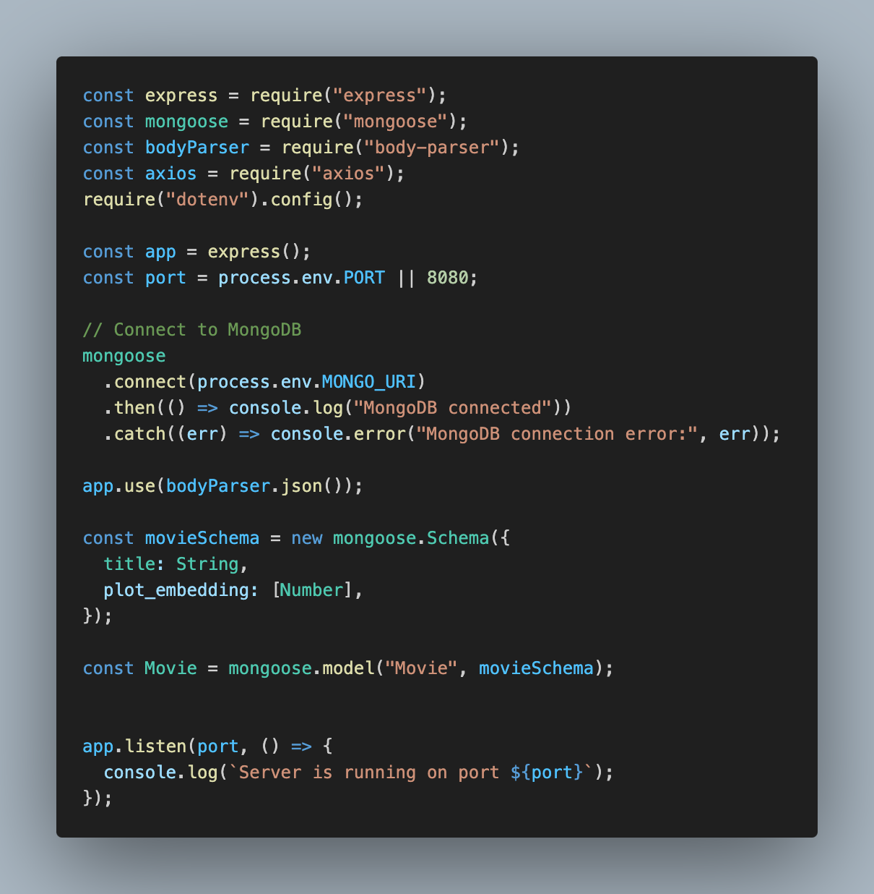
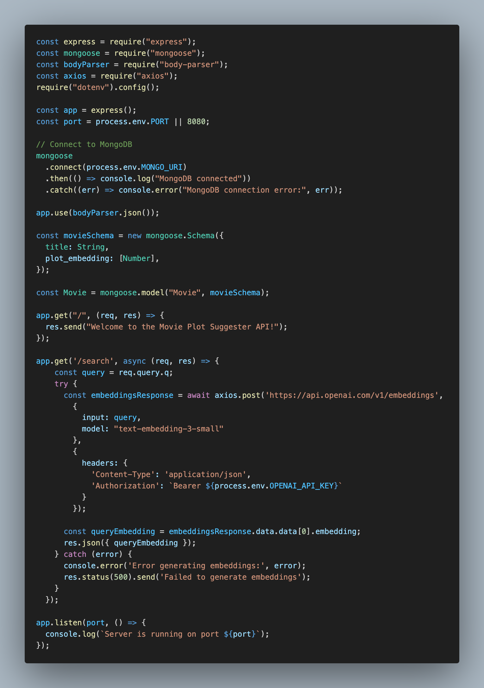
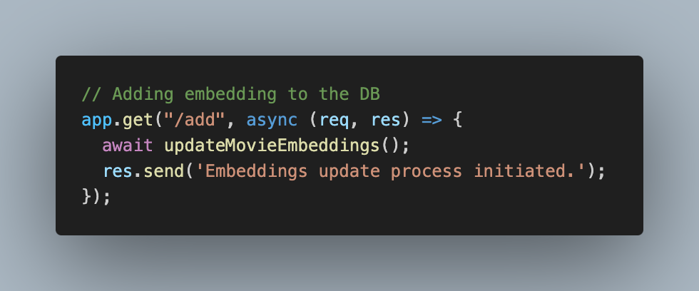
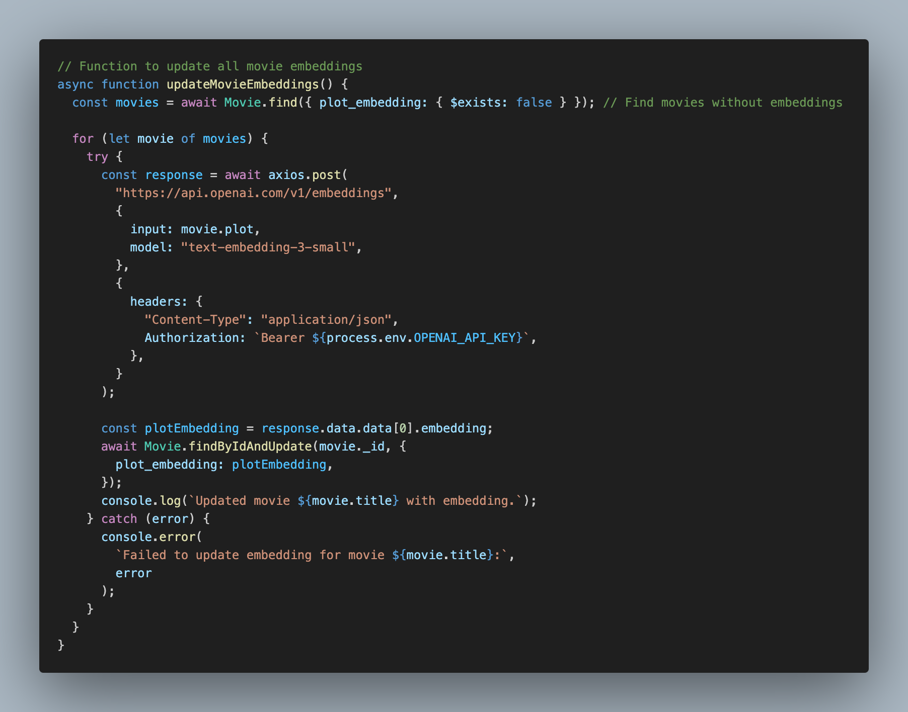
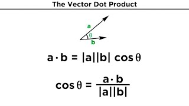
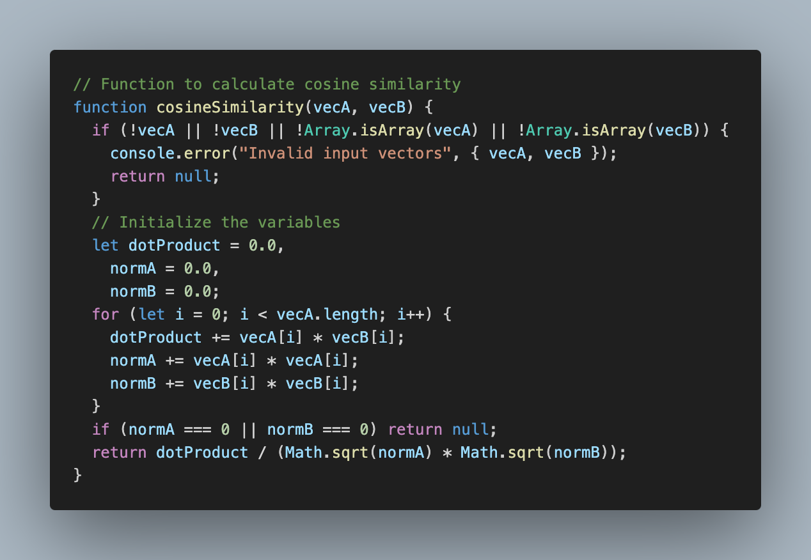
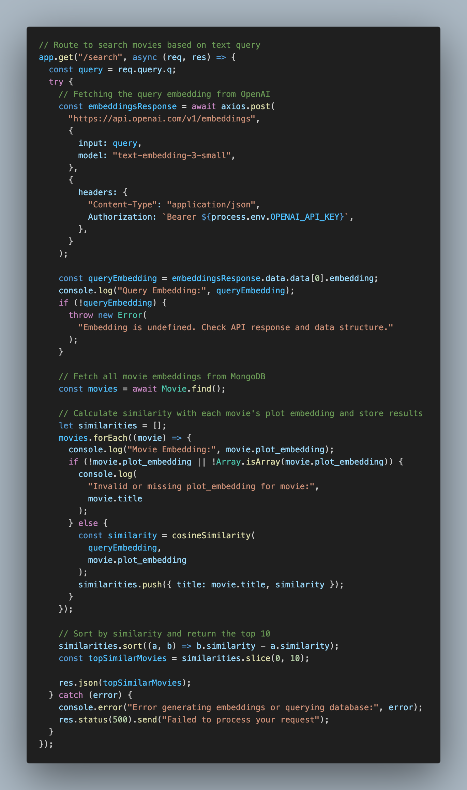
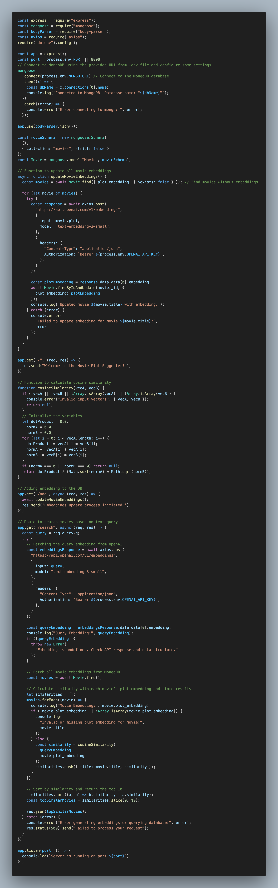
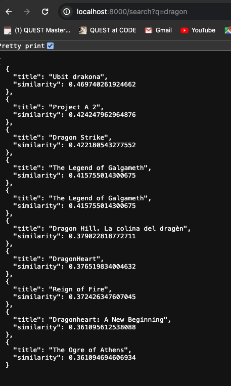

# Calculation similarity of search input query vector and plot embedding vector to search similar **top 10** movie (dot product applied example)

It is to have a better understanding of dot product and its applied method.

1. Set up server and DB using Node.js(express.js) and MongoDB

   

   

2. Generate sample movie DB in MongoDB

   

   With this sample DB, I am going to use `sample_mflix.movies`

3. Using openai, generate query embeddings(vectors)

   

   if I input this query `http://localhost:8000/search?q=dragon`

   

   

4. Update preexisting movie DB by adding embeddings based on the plot.

   

   

5. Calculate similarity using dot product(particularity calculate cosine between these ones) and normal vectors between the `query embeddings` and `plot_embeddings`.

   In order to calculate the cosine value between two vectors. it is required to know dot product. It is to calculate the angle between two vectors and projection of one vector onto another.

   Dot product formula,

   

   Since we need to determine the cosine value for finding similarity and display 10 top similar movies

   

   The cosine value (= similarity) between two vectors means these two vectors are similar

   

   

6. Display most similar movie titles (top 10) with the query

   

   According to the results, I could recognize it was quite accurate.

   

GitHub repository:
