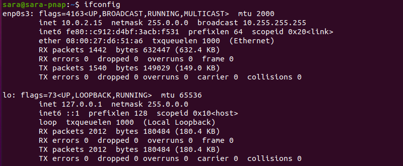
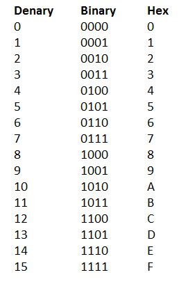
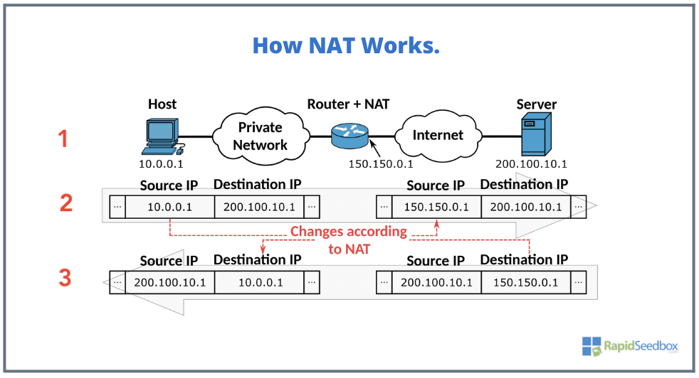
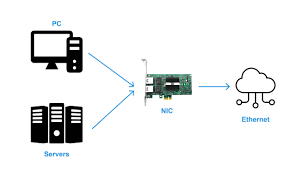

# Networking Refresher

from google

## IP addresses

### What is an IP address? (layer3)

IP addresses (logical addresses) are the numbers assigned to the every device on the computer networking. It is used to identify the communication across the internet. And also it is utilized to identify and locate devices on a network.

### How the IP address is structured?

There are main two versions of the internet protocols: **IPv4(Internet Protocol version 4)** and **IPv6(Internet Protocol version 6)**

**IPv4** is often referred to as "**inet**", which is shorthand for "**Internet**".

It is 32-bit and separated by a dot (.)(Dot-decimal notation).

For example,

`192.168.1.1`
= `11000000.10101000.00000001.00000001`

128 | 64 | 32 | 16 | 8 | 4 | 2 | 1
1 | 1 | 0 | 0 | 0 | 0 | 0 | 0

= 128 + 64 = 192

Binary (Base2) to Decimal(Base10)

**IPv6** is often referred to as "**inet6**"

It is 128-bit and separated by a clone (clone-hexadecimal notation)

For instance,

`2001:0db8:85a3:0000:0000:8a2e:0370:7334`
= `0010 0000 0000 0001 0000 0011 0110 1110 0000 0001 0110 1000 1100 0000 1100 0000 0000 0000 0000 0000 0000 0000 0000 0000 1000 1010 0010 1110 0000 0000 1101 1100 0000 0000 1110 0110 0110 0101 0011 0100`

Binary (Base2) to Hexadecimal (Base16)

More rules on it,

omitting leading zeros within a group and representing consecutive groups of zeros with a double colon `(::)`.

step1: `2001:db8:0:0:8a2e:370:7334:0`
step2: `2001:db8::8a2e:370:7334:0`

### Types of IP address

The different version of ip addresses (IPv4 and IPv6) can be divided into public and private ip addresses.

**Public IP addresses** are assigned to a device by the internet service provider (ISP)

**Private IP addresses** are assigned to devices on a private network, such as a home or office network

**Dynamic IP addresses change over time**. It can be used for devices such as computers, smartphones, and tablets, where a constant address is not necessary. And it is for devices that connect to a network temporarily, like guest devices or IoT devices, often use dynamic IP addresses.

**Static IP addresses** remain the same over an extended period and often used for services that require a consistent address, such as hosting a website or running a mail server.

### What is NAT

`NAT` is a method used by **routers or servers** to translate private, local IP addresses to a public IP address and vice versa.

This design, not only saves `IPv4` addresses (because of the address limitation of IPv4) but also adds a layer of security by hiding the internal IP addresses of local devices from the internet.

`NAT` is not needed in IPv6 addresses because IPv6 has a vast address space. This allows direct communication between devices, simplifying networks and improving security.

## MAC addresses (layer2)

A `MAC` (Media Access Control - physical address) address is identified under the `ether` field in network configurations. It consists of 48 bits, usually represented as a string of 12 hexadecimal digits. It is usually fixed and cannot be changed unless the device’s network interface is replaced or a process known as "**MAC spoofing**" is used.

MAC addresses are only relevant within the scope of the **local network** segment. When data needs to be transmitted beyond the local network, it is encapsulated in network packets that contain source and destination IP addresses.

A `MAC` address may look like `00:1A:2B:3C:4D:5E`. It allows devices to communicate with each other on a local area network (LAN). When data is sent from one device to another on the same network, it is encapsulated within Ethernet frames that contain the source and destination MAC addresses. Routers and switches use these MAC addresses to forward the data to the appropriate destination.

The first three pairs of the MAC address `00:1A:2B` are Organizationally Unique Identifiers (OUIs) that identify the manufacturer of the network interface card (NIC). Each NIC has a unique MAC address assigned by the manufacturer. The remaining three pairs `3C:4D:5E` are unique identifiers specific to that NIC, also assigned by the manufacturer.

## TCP(Transmission Control Protocol) and UDP (User Datagram Protocol)(layer4)

`TCP` is connection-oriented protocol(high reliability). It breaks data into smaller packets, assigns sequence numbers to them, and ensures they are reassembled correctly at the receiving end. It is widely used for applications that require guaranteed delivery, such as web browsing, email, file transfer, and remote login.

`UDP`, on the other hand, is a connection-less protocol. It is simpler and more lightweight, making it suitable for applications that can tolerate some data loss or delay. It simply sends data packets from one device to another without waiting for acknowledgements or retransmissions. UDP is commonly used for real-time applications like streaming media, online gaming, DNS (Domain Name System), and VoIP (Voice over IP).

### Three-way handshake for TCP connection

The three-way handshake is a process used by TCP to establish a connection between two devices. It is a sequence of three steps that takes place before data transmission can begin.

`SYN > SYN ACK > ACK`

1. `SYN (Synchronize)`: The initiating device (often referred to as the client) sends a TCP packet with the SYN flag set to the destination device (often referred to as the server). This packet indicates the desire to establish a connection and includes an initial sequence number.

2. `SYN-ACK (Synchronize-Acknowledge)`: Upon receiving the SYN packet, the destination device responds with a TCP packet that has both the SYN and ACK (acknowledge) flags set. This packet acknowledges the receipt of the initial SYN packet and also includes its own initial sequence number.

3. `ACK (Acknowledge)`: Finally, the initiating device acknowledges the SYN-ACK packet by sending an ACK packet back to the destination. This packet confirms the establishment of the connection and typically contains an incremented sequence number.

Once the three-way handshake is complete, the connection is established, and both devices are ready to exchange data. The sequence numbers exchanged during the handshake are used to ensure that data is transmitted and received in the correct order.

## Common ports and protocols

1. TCP
   FTP(File Transfer Protocol) | 21
   SSH(Secure Shell Protocol) | 22
   Telnet(It is to connect virtual terminal on local area networks) | 23
   SMTP(Simple Mail Transfer Protocol) | 25
   DNS(Domain Name System) | 53
   HTTP | 80
   HTTPS | 443
   POPS | 110
   SMB(Samba - file shares) | 139 + 445(In the later version of window)
   IMAP(Internet Message Access Protocol) | 143

2. UDP
   DNS(Domain Name System) | 53
   DHCP(Dynamic Host Configuration Protocol) | 67, 68
   TFTP(Trivial File Transfer Protocol) | 69
   SNMP(Simple Network Management Protocol) | 161

## OSI(Open Systems Interconnection) Model

It is a conceptual framework that represent how network communication work.

1. **Physical** | It is responsible for the transmission and reception of raw unstructured data bits over a physical medium | data cables, cat6
2. **Data** | It handles the reliable transmission of data frames between directly connected nodes over a physical link | switching, MAC addresses(ethernet), Wi-Fi, PPP(Point-to-Point Protocol)
3. **Network** | It enables the routing(the process of selecting a path across one or more networks) of data packets across different networks. It deals with logical addressing and determines the best path for data delivery based on network conditions and routing protocols | IP addresses, routing
4. **Transport** | It ensures the reliable and orderly delivery of data between end systems. It breaks data into smaller segments, manages end-to-end communication, and provides error recovery, flow control, and congestion control. | TCP and UDP
5. **Session** | It establishes, manages, and terminates communication sessions between applications. | session management
6. **Presentation** | It is responsible for data representation, encryption, compression, and formatting. It ensures that data sent by the application layer of one system is understandable by the application layer of another system | WMV, JPEG, MOV
7. **Application** | It is the closet layer to the end-user and provides services directly to the user applications. It includes protocols for various application-level services such as file transfer, email, web browsing, and remote access. | HTTP, SMTP, FTP, and DNS

This OSI model is a conceptual model and does not necessarily reflect the exact implementation of all networking systems, which often use a hybrid of various layers and protocols.

## IP subnetting and CIDR notations

In the `netmask` from `ifconfig`, we can find what the subnet looks like. It is the process of creating a sub-network within a network and commonly used in IPv4 networks. It helps improve network performance and security.

In this example,

- IP address: `192.168.1.1`
- Subnet Mask: `255.255.255.0`

This subnet mask `255.255.255.0` means the first three number (`192.168.1`) are the network part, and the last number (`.1`) is the host part. This allows up to `254` devices (from `.1` to `.254`) in this subnet.

CIDR (Classless Inter-Domain Routing) notation is a method used to represent IP addresses and their corresponding subnet masks.
