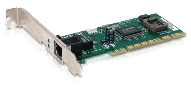
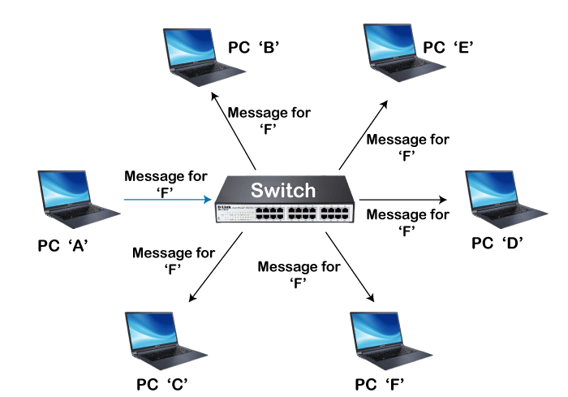
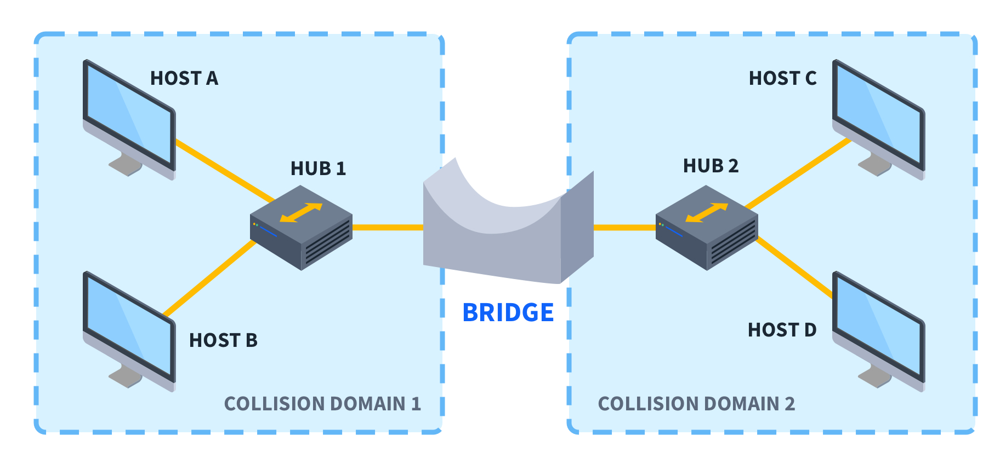

# Network

```
            [ Internet ]
                |
             (Modem)
                |
           [ Gateway/Router ]
                |
        ------------------------------
       |              |              |
    [L4 Switch]   [L3 Switch]   [Wi-Fi AP]
       |              |              |
[Load Balancer]   [L2 Switch]     [Laptop]
       |              |              |
       |           [Printer]    [NIC (Wi-Fi)]
       |            /     \
   [Server 1]    [PC1]   [PC2]
   [Server 2]     NIC     NIC


Other network devices:
[Bridge] - connects two segments of a network
[Repeater] - extends the range of the network by amplifying the signal
```

## NIC (network interface card)

In most modern computer and devices, the NIC (Network Interface Card) is built-in. It is hardware component that allows a computer or other device to connect to a network. Each NIC has a unique MAC address that identifies the device on the network. If I connect the lan cable to the interface. It is ready to get the data from switch.



## Switch

It allows device to connects multiple devices by on the same network within a building or home (LAN - Local Area Network). And also segment the networks into different subnets. It uses MAC addresses to forward data only to the device that needs to receive data from switch. It is responsible for filtering and forwarding the packets between LAN segments identifying MAC addresses.

- **L2 Switch (Data Link Layer - Layer2)** : Basic switches forwards data based on MAC address table. It is only intended as a recipient on the network. It keeps a record of MAC addresses and corresponding ports. It represents a separate collision.

- **L3 switch (Network Layer - layer3)**: More advanced switches that can perform some routing functions using IP addresses. It maintains IP routing table to determine the best path for forwarding data.So it is bidirectional switches.

- **L4 switch (transport layer - layer4)**: It is often referred to as a load balancer and traffic manager. It handles bidirectional traffic. It receives incoming requests from clients and distributes them to backend servers. It uses TCP/UDP port numbers to make forwarding decisions. It is ideal for data centers, web hosting environments, and large-scale applications where load balancing and advanced traffic management are crucial.



## Hub

It is a basic networking device that connects multiple devices within a local area network (LAN).
It operates at the physical layer - layer1 of the OSI model. It only handles incoming data.

**Hub** scenario,

There are three connected PCs. If PC1 sends a message to PC2, the hub will broadcast the message to all three PCs. Both PC2 and PC3 will receive the message, but only PC2 will process it. This can lead to unnecessary network traffic and potential data collisions.

However, in the **Switch** scenario,

Imagine a switch with the same three connected computers (PC1, PC2, and PC3). If PC1 sends a message to PC2, the switch will forward the message only to PC2. PC3 will not receive any data, reducing unnecessary traffic and avoiding collisions.

Thus, switch is more advanced device for networking in the LAN (Local Area Network).

## Router (Layer 3)

It connects multiple networks together and routes data packets between them based on IP addresses.

In a typical home or office network setup, a router connects the local area network (LAN) to the internet (WAN).

## Bridge (data link layer - layer2)

It connects segments of a single network at the data link layer for using MAC addresses for forwarding decisions. It also helps in segmenting a large network into smaller collision domains for improving overall network performance.



## Gateway (network layer - layer3)

It is to connect with two or multiple LAN (Local Area Network) with different protocols and architectures and serves as an entrance to another network. It translates data from one protocol to another, enabling communication between different networks. Router can be a common example of a gateway. And it manages data between these networks based on **IP addresses**.

.jpeg>)

IPS/IDS
Firewall
Storage
CDN
