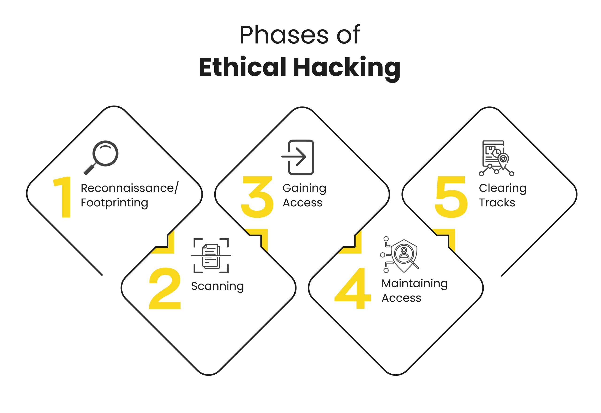

# The Five Stages of Ethical Hacking

This is the five stage I need to go through in every assessment. (**only for authorization and within the bounds of the law**)

## Reconnaissance

It is also known as information gathering.

### Passive reconnaissance (scanning)

This stage is for gathering information on google, Linkedin, other uncovered sources.

### Active reconnaissance (scanning)

It is for scanning port, remuneration (looking at items and digging into them to see if I can find anything of value), and finding vulnerabilities.

I can apply this methodology while doing different kinds of hacking.

## Exploitation

### Gaining access

It is to gain access into the target system or network. The focus is on exploiting vulnerabilities discovered during the scanning stage.

password cracking, social engineering, and exploit software vulnerabilities

### Maintaining the access

Once I have that access, the process starts to repeat. I need to do the scanning and enumeration again maintaining that access, for assessing the potential vulnerabilities.

bypassing security mechanisms, setting up backdoors or remote access tools, and establishing persistent access

## Post-exploitation

In the last stage, I need to remove the logs of my activities, files from the target machine system or network. And do not forget about restoring the system to its original state. The main reason is to remain undetected, leaving no traces of my activities.
