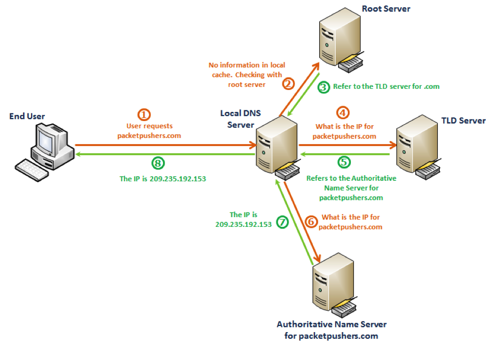

# BlackPearl

## Scanning / Enumeration

1. As usual, I started to scan the nmap of the target machine for a comprehensive scanning.

   `nmap -T4 -p- -A 192.168.64.25`

   

   

   Noted information

   `22/tcp open  ssh     OpenSSH 7.9p1 Debian 10+deb10u2 (protocol 2.0)`

   `53/tcp open  domain  ISC BIND 9.11.5-P4-5.1+deb10u5 (Debian Linux)`

   `80/tcp open  http    nginx 1.14.2`

   There were only three services running on the target machine.

   ### What is DNS(53) protocol?

   ISC BIND (Berkeley Internet Name Domain) is a software suite for managing Domain Name System (DNS) services on the internet. It is maintained by the Internet Systems Consortium (ISC). For example, when we visit google.com, DNS resolves the domain name into an IP address. BIND9 provides the mechanisms needed for translating human-readable domain names(google.com) into IP addresses(2607:f8b0:4005:813::200e - IPv6) and vice versa.

   In this command:

   - `9.11.5` is the version of BIND.
   - `P4` is the patch level for BIND.
   - `5.1` is the Debian-specific revision of the BIND package.
   - `+deb10u5` is the package is built for Debian 10 and has had 5 additional updates since the initial release.

   

2. I attempted to find uncovered directories on the server by using `gobuster`

   

   I found `/secret` page. Once I visited this page, it made me download a secret file.

   

   Hm... It said `Directory busting won't give anything`. Is that true? um...

   

   

   Failed to find the password for accessing openssh(22).....

   At that moment, I was really confused because there were no interesting clues such as cms version, file upload page, login page, robots.txt, or directory pages.

   So that I opened the inspection page for this website.

   

   

   

   There was a comment line mentioning `alek@blackpearl.tcm`. And it appeared that `blackpearl.tcm` might be another hostname accessible in firefox. The reason I thought in this way was that I have some previous experiences of adding a hostname and ip for fixing dns issues. In those instances, resolving DNS issues by adding a hostname and IP address to my local `/etc/hosts` file often resolved the problem of accessing web services. This approach was effective especially when dealing with non-publicly resolved hostnames, which could otherwise result in a blank page with no content.

   To gather more information for enumerating this HTTP service, I added the hostname and IP address to the `/etc/hosts` file.

   

   

   And then attempted to find hidden directories.

   

   

   

   First, `/`, `index.php`

   

   Second, `/crossdomain.xml`

   

   Final, `/navigate`

   

   

   `/navigate` page used `Navigate CMS v2.8`.

   I thought it would be great to utilize this cms vulnerability to get a shell at first.

   By googling navigate cms v2.8, I found a really attractive resource, which is the exploitation of Unauthenticated Remote Code Execution vulnerability.

   resourced from (https://www.rapid7.com/db/modules/exploit/multi/http/navigate_cms_rce/)

   

   

   

## Exploitation

1. I used `metasploit` to exploit this vulnerability as follows.

Set rhosts(target IP address) and then ran the payload

I used `shell` command to convert meterpreter session into a standard shell and then `python -c` to spawn an interactive shell.

And then I attempted to list all files with the SUID bit set.

`find / -perm /4000 -exec ls -al {} \; 2>/dev/null`

- `find /`: Starts searching from the root directory.
- `perm /4000`: Finds files with the SUID bit set.
- `exec ls -al {} \;`: Executes `ls -al` on each found file. `{}` is a placeholder for the found file, and `\;` indicates the end of the `-exec` command.
- `2>/dev/null`: Redirects error messages to `/dev/null` to keep the output clean.

`php7.3` was somewhat different from what I checked out different target machines before.

So I made a decision to use `gfobins` in order to exploit `php` for suid. Fortunately, I found the way to exploit it for privilege escalation.

Let's begin to exploit it for getting root.

Success!

I could read the final `flag.txt`

### What is virtual host routing?

This concept is to embrace more than one web site on one system or web server. For example, `www.example1.com` and `www.example2.com` can both be hosted on the same server.

