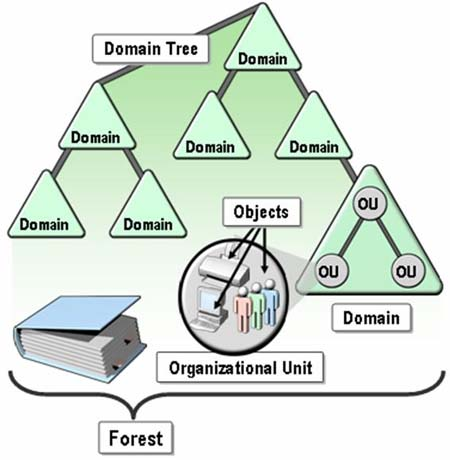
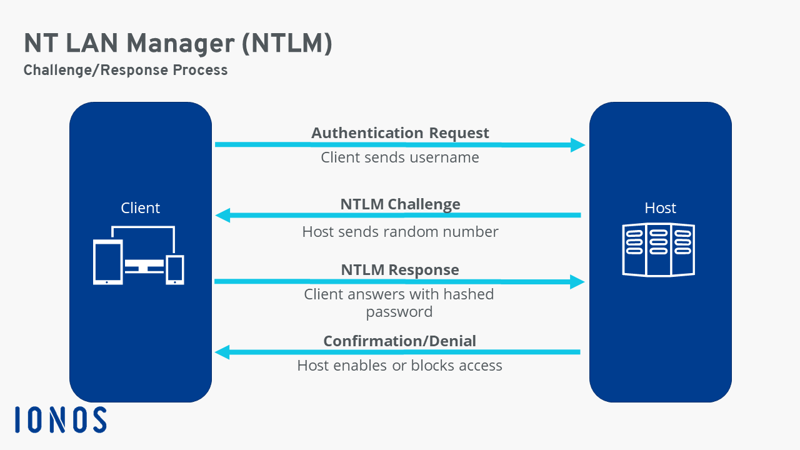

# Active directory 1

## Overview

### What is the active directory?

Active Directory (AD) is like a phone book for Windows networks. Approximately 95% of Fortune 1000 companies implement this service in their networks, making it a core component of most enterprise environments since its release in 2000. AD can be exploited not by attacking patchable vulnerabilities but by abusing its features, trusts, and components.

The critical concept of AD is **Centralization** for the creation and management of user accounts. User accounts are stored as objects made up of attributes. A wide variety of objects are stored in the Active Directory database. It utilizes the **Kerberos protocol** for secure authentication, ensuring that users can efficiently and securely access network resources. When users attempt to log on to a network using Active Directory, several processes and components work together to ensure secure and efficient access to resources.

Here are the logon processes:

1. Once a user attempts to log on to a network by typing username and password, the client computer sends this information to the Active Directory server, which is called the Domain Controller.

2. The DC(Domain controller) checks user's name and password. If they are correct, DC creates a special digital pass called a Ticket Granting Ticket (TGT). It is like a temporary ID card. With this ticket, a user can request access to other network resources without needing to re-enter credentials.

3. If a user wants to access a resource, the client computer asks the Domain Controller for a Service Ticket specific to that resource.

4. Once a user accesses the resource they want, the resource checks the Service Ticket and lets the user in if every is correct.

5. Changes for user accounts, security policies, and other directory information are replicated across all domain controllers to ensure consistency.

Since the user password is not sent around the network all the time, the encrypted tickets can provide the enhanced authorization and authentication service.

And it can be convenience because users can access multiple resources without re-entering their passwords.

Finally, admin can easily manage user access and enforce security policies from a central location.

### Physical Active Directory Components

- **Domain Controllers(DCs)** hosts a phone book. It provides authentication and authorization services. And it allows administrative access to manage user accounts and network resources. Once a user modify/create an account information, domain controllers replicate updates to other domain controllers. It handles authentications issuing Kerberos tickets(ticket granting ticket and service ticket). Organizations typically deploy several Domain Controllers (DCs), each of which maintains a copy of the directory for the entire domain.

- **AD DS(Domain Services) Data Store** contains the database files and processes that store and manage directory information for users, services, and applications. It consists of the `Ntds.dit` file. It is stored by default in the `%SystemRoot%\NTDS` folder on all domain controllers. The data store is accessible only through the domain controller processes and protocols.

- **Global Catalog Server** contains the information about Active Directory objects of all domains within a forest, enabling users and applications to find directory information regardless of which domain is it in.

- **Read-Only Domain Controller (RODC)** is a type of domain controller that stores a read-only copy of the Active Directory database.

### Logical Active Directory Components

- **Schema** defines every type of object that can be stored in the directory. It enforces rules regarding object creation and configuration. It serves as a rule-book or blueprint.

  - **Class object** represents the types of objects that can be created in the directory, such as User, Computer, and Printer.
  - **Attribute object** refers to the information that can be attached to an object, such as Display name.

- **Domains** are used to group and manage objects in an organization. (www.google.com)

  - **An administrative boundary** is for applying policies to groups of objects
  - **A replication boundary** is for replicating data between domain controllers
  - **An authentication and authorization boundary** provides a way to limit the scope of access to resources

- **Tree** is a hierarchy of domains in Active Directory Domain Services (AD DS). For example, domains like news.google.com, mail.google.com, and translate.google.com share a contiguous namespace with the parent domain, google.com. By default, a tree creates a two-way transitive trust with other domains within the same forest.

- **Forest** is a collection of one or more domain trees. It shares a common schema, configuration partition, global catalog to enable searching and the enterprise admins and schema admins groups. Furthermore, it enables trusts between all domains in the forest. And compromising a domain admin in a forest does not necessarily mean that that's an enterprise admin. However, it is possible to elevate to an enterprise admin or something like that by crossing the forest with that account.

- **Organizational Units(OUs)** are Active Directory containers that can hold users, groups, computers, and other OUs. OUs represent the organization hierarchically and logically, allowing for consistent management of a collection of objects, delegation of permissions to administer groups of objects, and the application of policies.

  Different types of objects

  - **User**: Enables network resource access for a user.
  - **InetOrgPerson**: Similar to a user account. Uses for compatibility with other directory services.
  - **Contacts**: Uses primarily to assign e-mail addresses to external users. and it does not enable network access.
  - **Groups**: Uses to simplify the administration of access control.
  - **Computers**: Enables authentication and auditing of computer access to resources.
  - **Printers**: Uses to simplify the process of locating and connecting to printers.
  - **Shared folders**: Enables users to search for shared folders based on properties.

- **Trusts** provide a mechanism for users to gain access to resources in another domain. All domains in a forest trust all other domains in the forest. And trusts can extend outside the forest.

  - **Directional trusts** flow from trusting domain to the trusted domain
  - **Transitive trusts** extend the relationship beyond a two-domain trust to include other trusted domains.

  

## Building out AD lab

Requirements

- 1 Windows server 2022 for setting up domain controller / `192.168.64.32`
- 2 Windows 11 enterprise workstations for setting up user machines and policies

  - Computer Name: THEPUNISHER / `192.168.64.33`
    
  - Computer Name: SPIDERMAN / `192.168.64.34`
    

  

  

  

  

  

  To verify Domain connections

  

  

  To verify DNS connections

  

  

  

Even though I set my victim ad environment manually by following the heath's instructions, It will be great to use this resource if you want to set AD environment without any guidance.

[https://github.com/Dewalt-arch/pimpmyadlab?tab=readme-ov-file]
[https://www.bowneconsultingcontent.com/pub/EH/proj/D7.htm]

And, I got many helps from TCM discord.

## Attacking Active Directory: Initial Attack Vectors

1.  LLMNR(Link Local Multicast Name Resolution) Poisoning attack

    - LLMNR (Link-Local Multicast Name Resolution): A protocol used for name resolution on local networks when DNS is unavailable. It allows devices to query each other directly for name resolution.

    - NBT-NS (NetBIOS Name Service): A legacy protocol for name resolution over IP networks, primarily used in Windows environments.

    Both protocols can be exploited by attackers through poisoning attacks, where malicious actors respond to legitimate queries with fake data to intercept or redirect traffic.

    Here are the attack processes

    Step 1, Run `responder`

    `responder` is a tool to capture credentials, for example, once a target sends out an LLMNR request by inputting attacker's ip address (`\\192.168.64.11`) on the File explorer, for making an event, the `responder` will send a response to the server directing all traffic to the attacker.

    `sudo responder -I eth0 -dwv`

    `-I eth0` is to specify the network interface to use.

    `-d` is to run the responder in diagnostic mode.

    `-w` is to capture WPAD requests and serve malicious responses.

    `-v`is to get detailed information about the what responder is doing.

    Waiting for the response.

    

    

    Step 2, Input attacker's ip address on the victim's (THEPUNISHER(Computer Name) - fcastle(User Name)) and Get the response from it.

    

    

    

    ### What is NTLM?

    It is a suit of Microsoft security protocols for providing authentication, integrity, and confidentiality to users. It is a different with Kerberos protocol.

    One of the characteristics is that the hash used by NTML is not as strong as the encryption method used by Kerberos protocol.

    Here is the authentication process of NTML protocol

    

    Step 3, Save one of the hashes and crack the hash

    

    

    Need to set a proper module to crack the password

    Since the smb response was `NTMLv2`, set `5600`. However I visited `hashcat` wiki to check the hash format that I want to crack.

    

    

    Attempt to crack the hashed password with the module and wordlists

    

    

    

    Cracked password is `Password1`

2.  LLMNR(Link Local Multicast Name Resolution) Poisoning Defenses (Mitigation)

    To disable `LLMNR`, just select "Turn OFF multicast name resolution".

    In the DC server,

    

    Go to Group Policy Management

    Click `Computer Configuration` > `Administrative Templates` > `Network` > `DNS Client` > `Turn off the multicast name resolution`

    

    Hit the `Enabled` > `Apply` > `OK`

    

    To disable `NBT-NS`, just select "Disable NetBIOS over TCP/IP".

    Go to `Network Connections` > `Network Adapter Properties` > `TCP/IPv4 Properties` > `Advanced tab` > `WINS tab` > `Disable NetBIOS over TCP/IP`

    

    

    

    

    If a company must use or cannot disable LLMNR/NBT-NS, the best course of action is to require **strong password** and **Network Access Control** for ensuring only authorized devices connections to the network.

3.  SMB Relay Attacks

    SMB is a protocol for a network file sharing.

    Instead of capturing a hash with the responder tool, this SMB Relay Attack occurs when an attacker captures authentication requests (like password hashes) and then relays them to another machine to gain unauthorized access.

    The relayed user credentials need to have administrative privileges on the target machine to provide significant access. This is why targeting admin accounts is crucial. And I cannot relay the credentials to the same machine the credentials were captured from.

    At the moment, Frank Castle (username) from the MARVEL.local domain is admin privileged on two machines (THEPUNISHER and SPIDERMAN)

    1. Identify the workstations without SMB singing enforced(set as default)

    `nmap --script=smb2-security-mode.nse -p445 192.168.64.0/24`

    `--script=smb2-security-mode.nse` is to query the SMBv2 security configuration of a target host.

    

    

    The result says "Message signing enabled but not required". That means this is a default setting for all Windows workstations. Attackers can exploit this weak validation for gaining shell access.

    2. Set up Responder.conf (SMB = Off, HTTP = Off)

    

    Yes, I used mousepad for the quick revision.

    

    The reason behind this is that I will utilize `Responder` and `ntlmrelayx` for this attack.

    To be specific, if the responder is listening for SMB or HTTP requests, it may respond to the captured authentication requests instead of allowing them to be relays. Moreover, by disabling SMB and HTTP in Responder, it can be ensured that only desired traffic (LLMNR or NBT-NS) should be captured and then forwarded to `ntlmrelayx`.

    Launch the responder

    

    

    

    Finally, start `ntlmrelayx` and wait for an event to occur

    Before, launch the tool, I saved `targets.txt` to specify the list of target IP addresses.

    

    `ntlmrelayx.py –tf targets.txt –smb2support -i`

    `ntlmrelayx` will listen for incoming NTLM authentication requests. When a victim sends an NTLM authentication request, this tool captures the request and attempts to relay it to one of the targets specified in `targets.txt`

    `-tf` stands for target file

    `targets.txt` is a file that contains a list of target IP addresses

    `--smb2support` is to enable support for SMBv2

    `-i` is to run the tool in interactive mode

    

    Ready to go!

4.  Input the attack ip address on the victim machine (THEPUNISHER) for occurring an event

    

    The responder captures this event and then passes it to `ntlmrelayx`.

    In `Responder`,

    

    In `ntlmrelayx`, local SAM hashed are dumped. These hashes can be cracked.

    

    In another type of relay attack,

    I can gain a shell access by SMB client.

    Here are the processes.

    `ntlmrelayx.py –tf targets.txt –smb2support -i`

    `tf` stands for target file

    

    

    It says "Started interactive SMB client shell via TCP on 127.0.0.1:11000", let's begin to connect this SMB Client shell!

    

    

    Furthermore, I am going to gain the shell from the attacks.

5.  SMB Relay Attack Defenses (Mitigation)

    - Enabling SMB signing on all devices can completely stop the attack, but it can cause performance issues with file copies and legacy devices using `SMBv1`

    `Computer Configuration` > `Policies` > `Windows Settings` > `Security Settings` > `Local Policies` > `Security Options`

    Enabled:

    Microsoft network client: Digitally sign communications (always)
    Microsoft network client: Digitally sign communications (if server agrees)
    Microsoft network server: Digitally sign communications (always)
    Microsoft network server: Digitally sign communications (if client agrees)

    - Disabling NTLM authentication on network can completely stops the attack. However, if Kerberos stops working, Windows defaults back to NTML

    - Account tiering limits domain admins to specific tasks, for example only log onto servers with need for DA. But it can enforce the policy difficult

    - Local admin restriction can prevent a lot of lateral movement. Nevertheless, but it can also increase the workload for the service desk because Service desk staff might need to frequently grant temporary administrative rights or perform administrative tasks on behalf of users.

6.  Gain the shell access

    1. Initial shell access using `metasploit`

       [https://www.rapid7.com/db/modules/exploit/windows/smb/psexec/]

       I am going to use `psexec`

       ### What is psexec?

       It is stands for "Process Execute". It is designed to allow administrators to perform various activities on remote computers.

       Since I knew the password and username through the previous attacks, I am going to vulnerability to gain the shell access.

       I got some issues in the process of the initial meterpreter through metasploit. The problems were resolved by disabling firewalls(domain, private and public) of the target machine and updating metasploit.

       - MARVEL.local domain exploitation

       

       

       

       

       

       

       

       

       - Local administrator user exploitation

       Important: `set smbdomain .` is needed to set the domain under local.

       

       

    2. Manual ways to get the shell accessing

       I am going to use the python3-impacket tool.

       Impacket allows craft and decode network packets of various protocols, such as SMB, NetBIOS, TCP, IP, UDP, and others.

       

       

       

       

       

7.  IPv6 Attacks - LDAP relays

    IPv6 is a newer version of IPv4 because of no sufficient available IPv4 addresses. IPv6 is used for data transmit between network and system. IPv6 addresses can be resolved through DNS just like IPv4 addresses, with DNS returning IPv6 addresses (AAAA records) in response to queries. Common network services and authentication protocols, such as LDAP and SMB, also support IPv6.

    As networks transition from IPv4 to IPv6, many organizations operate dual-stack networks, supporting both protocols. This can introduce security challenges, especially since IPv6 implementations might not be as tightly secured due to a lack of familiarity among network administrators.

    One of the prominent tools used for IPv6 attacks is **MITM6 (Man-in-the-Middle 6)**. MITM6 exploits the automatic configuration features of IPv6 to redirect network traffic to an attacker.

    The tool works by sending malicious IPv6 Router Advertisements (RA) to force devices on the network to route their traffic through the attacker’s machine. This allows the attacker to intercept, monitor, and manipulate the data being transmitted.

    Here are the processes I followed,

    Issue: In this attack, I should have to create a new user at the end. However I am still figuring out how to make a new domain user.

    1. Run `mitm6` to spoof the target network's IPv6 DNS requests.

    `mitm6 -d marvel.local`

    `-d` is to indicate the domain name

    

    2. Run `ntlmrelayx` to forward the intercepted authentication attempts to the LDAP service

    `ntlmrelayx.py -6 -t ldaps://192.168.64.32 -wh fakewpad.marvel.local -l lootme`

    

    3. Reboot the target machine

    

    4. Success authentication

    It says `HTTPD(80): Authenticating against ldaps://192.168.64.32 as MARVEL/THEPUNISHER$ SUCCEED`

    

    

    5. Check the downloaded dir `lootme`

    

    

    

    

    

    

    6. Once I attempted to log in as a domain administrator, I should have created a user, but I failed. Let me try again.

8.  IPv6 Attack Defenses (Mitigation)

    Yes, disabling IPv6 will be complete solution to defend this attack. However it will not be great idea with no doubt and have side effects.

    First, relaying to LDAP and LDAPS can only be mitigated by enabling both LDAP signing and LDAP channel binding.

    Second, disabling WPAD (Web Proxy Auto-Discovery Protocol) can be an effective mitigation strategy to enhance network security. Because WPAD can be exploited by attackers to perform man-in-the-middle attacks.

    In the Group Policy Management Console,

    `Computer Configuration` > `Administrative Templates` > `Windows Components` > `Internet Explorer` > `Disable caching of Auto-Proxy scripts (Enabled)`

    Third, by using Use Access Control Lists (ACLs), only necessary IPv6 traffic should be permitted.

## Attacking Active Directory: Post Compromise Enumeration

1. Idapdomaindump

   It is a tool to extract information from a domain controller in a network.

   `ldapdomaindump ldaps://192.168.64.32 -u 'MARVEL\fcastle' -p Password1`

   `ldaps://192.168.64.32` is to specify the IP address (LDAP server)that I want to connect. LDAP (Lightweight Directory Access Protocol) is a protocol used to access and manage directory services (accessibility to information about the resources in a network). And `LDAPS` means LDAP communication will be encrypted over SSL.

   `-u` is to specify the username for authentication. In this command, I indicated `MARVEL` domain name and fcastle username.

   `-p` is to specify the password. In this command, I provided password `Password1`.

   

   

   

   

   

2. Bloodhound

   In this enumeration, I am going to use neo4j. Neo4j is a DBMS for graph type database.

   First, install `pip install bloodhound` and `apt install neo4j`

   

   

   Second, run `neo4j console` to initialize the Neo4j server

   

   

   go to `http://localhost:7474`.

   the first username and password will be `neo4j:neo4j`. After login success, it is possible to revise password that I want.

   

   

   Third, run the `bloodhound`,

   

   open the bloodhound and then login with the username and changed password,

   

   and then boom!

   

   clear the data and then make directory

   

   

   Fourth, execute `bloodhound-python -d MARVEL.local -u fcastle -p Password1 -ns 192.168.64.32 -c all`

   `-ns` is to specify the server ip address

   `-c` is to indicate that I want to extract all data

   

   

   I got all information.

   

   upload the data I got

   

   

   Select all the json file

   

   

   Once the upload is completed, click `clear finish` and then `X`

   

   

   

   

   

3. PlumHound

   Github: https://github.com/PlumHound/PlumHound

   install PlumHound

   

   

   

   

   run the plumHound

   Before running this tool, the bloodhound should still be up.

   `python3 PlumHound.py --easy -p neo4j1`

   `--easy` is to indicate the script should run in easy mode, meant for quick setups and less customization.

   `-p` is to specify the password of neo4j

   

   

   `python3 PlumHound.py -x tasks/default.tasks -p neo4j1`

   `-x` is to specify an external file that contains tasks or operations for PlumHound to execute.

   `tasks/default.tasks` means that I want to execute default task files of PlumHound.

   

   114 tasks found in the `tasks/default.tasks` file.

   

   The output files are stored in the `reports` directory.

   

   

   launch the file on the firefox

   

   

   

   
