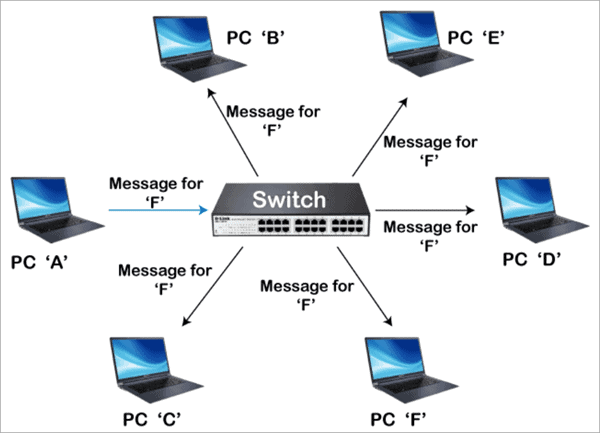
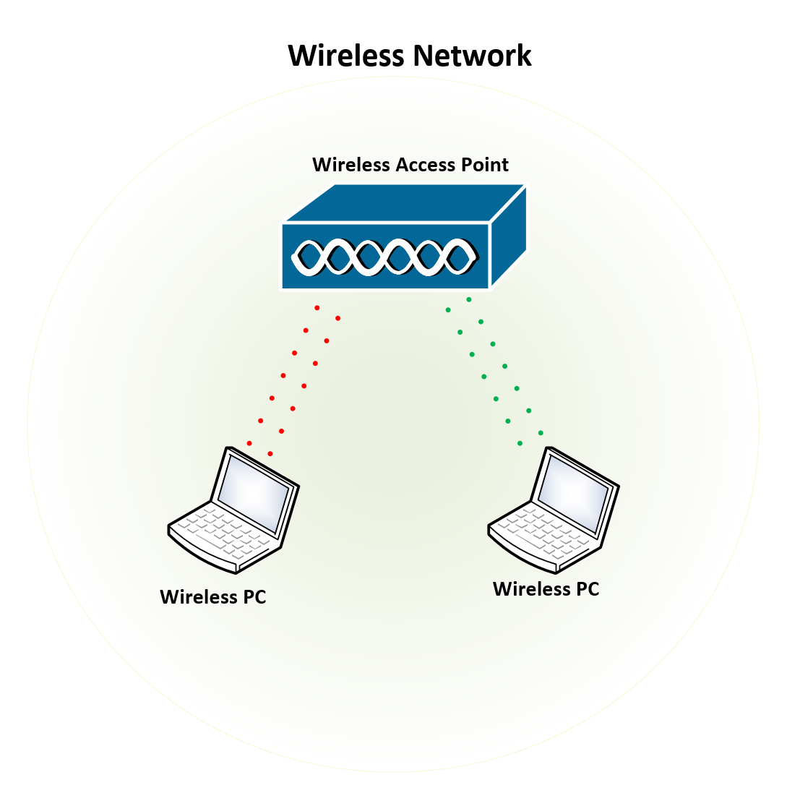
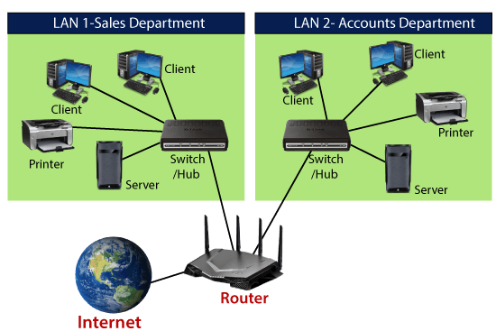
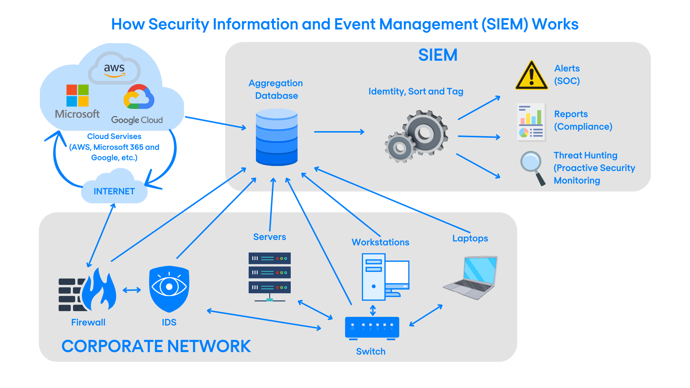
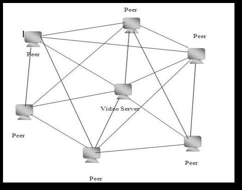

# Network fundamentals

## Network Components

### What does the networks actually consist of?

- Client : Devices that users access the network with.

- Server : Provide resources/services to the network.

- **Hubs** : Are older network devices that connect other devices like clients and servers over **a local area network**.

They are simple devices that broadcast incoming data packets to all connected devices, so if two devices send data simultaneously, a collision occurs, and the data must be resent. Thus this can lead to network inefficiencies.

Moreover, Hubs lack any form of security features, so data is indiscriminately sent to all devices, which can be a security risk.

- **Bridges** : Are network devices used to connect and filter traffic between two or more LAN segments within a local area network.

Bridges use **MAC addresses** to forward data only to the appropriate segment. By doing so, they help reduce network collisions by creating separate collision domains for each segment. Bridges also play a crucial role in **segmenting large networks into smaller**, more manageable sections, enhancing performance and security. However, bridges do not have the advanced features of modern switches and are less scalable for larger networks.

- **Switches** : Are much smarter version of the hub and bridge. They provides more security and more efficient bandwidth utilization. Because they forward traffic from one port to the intended destination port. And **they can receive and analyze the data packets from devices on the network in order to determine the correct destination**.

They forward traffic from one port to the intended destination port based on **the MAC address** of the devices, which eliminates unnecessary data transmission and significantly reduces collisions.

- **Wireless Access Points (WAPs/APs)** : Allow wireless devices to connect to a wired network. They are used to broadcast data, that means a data packet is sent from one device to all other devices on the same network segment, over a radio frequency wave.

- **Routers** : Are a crucial component in the modern networks because they are used to connect different networks together. They can forward data based on the **IP addresses** of the clients, servers, and other devices over the network.

Modern routers predominantly rely on the internet protocol to route the traffic across the network using many different types of routing protocols. Routers can also provide security. Embedded firewall and content filtering software provide an additional protection from unwanted content and malicious websites without affecting the online experience.

- **Firewalls** : Serve as security barriers between internal networks and the external world. They can monitor incoming and outgoing network traffic based upon predetermined security rules by using **Access Control Lists(ACL)**.

It helps protect our network from unauthorized access, cyber attacks, and other online threats. Firewalls can be either hardware based, software based, or a combination of both of these.

- **Load Balancers** : Are can be devices or software that distribute network or application traffic across multiple servers. These increase efficiency, capacity, and reliability of the services by ensuring that no single server is going to bear too much of that demand.

So Load balancers prevent any one server from becoming a bottleneck, improving overall network performance.

- **Proxy** : Acts as an intermediary between a user's device and the internet.

It provides functionalities including web filtering (restricting access to certain websites of types of content), shared network connections, data caching to improve overall performance by storing frequently accessed web pages, and enhanced security and privacy by hiding/masking the user's real IP address and limiting their exposure to the internet.

- **Intrusion Detection Systems (IDS)** : Monitors network or system activities for suspicious behavior or unauthorized access. It detects threats using known attack **signatures or unusual activity patterns** and alerts administrators. Operating passively, IDS does not block threats but serves as a key tool for detecting potential security breaches.

- **Intrusion Prevention Systems (IPS)** : Are not only detect threats, but also take action to prevent intrusion like blocking that traffic from entering network or dropping any kind of harmful packets.

- Security Information and Event Management (SIEM) : Is a comprehensive cybersecurity solution that combines two primary functions

  - **Security Information Management (SIM)** : Involves the collection, storage, and **analysis of log data** from various sources across an organization's IT infrastructure. SIM helps in identifying long-term trends and providing reports that aid in compliance and auditing.

  

  - **Security Event Management (SEM)** : Focuses on **real-time monitoring and correlation of events** across the network, allowing security teams to detect and respond to potential threats more quickly.

- **Controllers** : Are central units used to manage **flow control to networking devices**. This enables administrators to dictate the behavior of the network switches and routers through software and this gives us more flexibility and efficiency.

- **Network-Attached Storage (NAS) Device**: Is a storage device that connects directly to a network, allowing users and devices on the network to store and retrieve data.

- **Media** : Refers to the physical materials used to transmit data.

- **Wide Area Network (WAN) Link** : Used to connect networks over large geographical areas.

## Network resources

- **Client-Server Model** : Used a server to access to network resources (files, scanners, printers, etc.)

It is a leading model we use in business networks.

Pros,

1. This network model serves centralized administration.
2. It is easier management.
3. It has better scalability.

Cons,

1. It costs more money because it requires dedicated hardware, software, or OS.
2. It requires specialized skill-set to run all those things.

- **Peer-to-Peer model** : Peers or other machines can share resources together directly.

The administration and backup is very difficult because all the files are located on different machines in different places. So it can occur redundancy.

### Where the Peer-to-Peer useful?

Each person of the network have and received files.

Pros,

1. There is lower costs because there is no dedicated hardware.
2. There is no specialized OS or dedicated resources.

Cons,

1. It is decentralized management system.
2. It is extremely inefficient for large networks.
3. It has poor scalability.

## Network Geography

- **Personal Area Network (PAN)** : Are smallest type of wired or wireless network which usually covers a distance about 10 feet or less (such as USB, Bluetooth).

- **Local Area Network (LAN)** : Connects components in a limited distance, generally up about 100 meters or 300 feet. (WIFI, Ethernet).

**WiFi** | **IEEE 802.11**
**Ethernet** | **IEEE 802.3**

- **Campus Area Network (CAN)** : A building-centric LAN that is spread across numerous buildings in a certain area.

- **Metropolitan Area Network (MAN)** : Connects locations that are scattered across the entire city.

- **Wide Area Network (WAN)** : Connects geographically disparate internal networks. (Virtual Private Networks - VPN, Lease Lines, Internet)

WAN does not always have to be public like the internet.

**PAN** < **LAN** < **CAN** < **MAN** < **WAN**

## Wired Network Topology

### Physical Topology

Physical topology describes how network devices and components are physically cabled and connected using various types of copper or fiber media. Below are the common types of physical topologies

### Logical Topology

It talks about how the traffic/data is actually going to flow in the network.

**Point-to-Point Topology** : This is the simplest form of network topology that involves a direct connection between two devices. It is often used for connecting a computer to a network peripheral, such as a printer or scanner, for small-scale connections. However, it is not practical for larger enterprise networks.

**Ring Topology** : A network configuration where each device is connected to two other devices, forming a circular data path. This topology prevents data collisions due to its unidirectional flow. However, if one node fails, it can disrupt the entire network unless redundant connections are available for failover.

- Modern Usage: Although not commonly used today, Ring Topology can be found in Fiber Distributed Data Interface (FDDI) implementations. FDDI is used for data transmission over fiber optic lines in a local area network (LAN) and can extend up to about 200 kilometers.

- FDDI Ring Structure: Operates on a dual-ring structure, providing redundancy with a primary and secondary ring. If the primary ring fails, the secondary ring can maintain network operations, making it suitable for large data transfers and high-reliability requirements, such as in data centers or campus area networks.

**Bus Topology** : In this topology, all network devices are connected to a single central cable, called the bus or backbone. Any device can send data, and it is available to every other device on the bus. However, only the intended recipient processes the message.

- Advantages : Easy to install and requires less cable than other layouts.

- Limitations : The entire network can be disabled if the main cable fails. Additionally, as more devices are added, network performance decreases due to increased data collisions. Bus Topology is rarely used in modern home or office networks.

**Star Topology** : One of the most common network layouts that is in use today. Each node in the network is going to be connected to back to a centralized connection point, which is normally going to be a network switch. That switch can also act as a repeater for the network's data flow.

- Advantages : It is considered to be very robust because the failure of one link does not affect any of the other links.

- Limitations : if the central devices fails, the entire network fails/inoperable.

**Hub-and-spoke Topology** : A variation of the star topology where the central node (hub) is connected to multiple nodes (spokes). The spokes are not directly connected each other. so they much transmit their data to one of the hubs, before that data is going to be forwarded to another hub and then onward to the final destination nodes in that spoke. This layout is commonly used in airlines as well as in telecommunication networks.

- Advantages : It can save a lot of money by not having to connect every one of those smaller offices to each of the other smaller offices all over the country.

**Mesh Topology** : Features a point-to-point connection between every single device on the network to create a robust and redundant network.

- **Full-mesh Topology** : every node is connected to every other node in the network. It provides high redundancy, but it can be very expensive and complex to install because of the number of cables and ports required.

- **Partial-mesh Topology** : some nodes are organized in a full mesh schema, while others are only connected to one or two devices in the network.

## Wireless Network Topology

**Infrastructure Mode** : Most common type of wireless network. It **uses a wireless access point** as a centralized point.

**Ad Hoc Mode** : Known as Ad Hoc. It is **decentralized** wireless network which creates Peer-to-Peer connections and **does not require a router or access point**. This can allow people to jump in and out of the network as much as they want.

**Wireless Mesh Topology** : Is an interconnection of different types of nodes, devices, and radios to create this mesh topology. Bluetooth, cellular, wi-fi, satellite, microwave, and all of them can combine into this single wireless network. So that we can expand the network access. This provides us redundant and reliable connections.

### Where might we use a wireless mesh topology?

A wireless mesh topology is often used in environments where reliable, widespread wireless coverage is required, particularly in areas that are large, complex, or difficult to wire.

## Data-center Topology

**Three-tiered hierarchy** : In a traditional data center topology, the three-tiered hierarchy is a widely used design that organizes the network into three distinct layers: **Core**, **Distribution (or Aggregation)**, and **Access (or Edge)**. Each layer has a specific role in ensuring efficient data flow, management, scalability, and redundancy.

- Core : The Core Layer is the backbone of the data center network, providing **high-speed and reliable connectivity between various distribution layers and external networks**. **It is responsible for routing and forwarding large amounts of data quickly and efficiently**. The Core Layer is designed for high availability and typically features redundant links and devices to prevent downtime.

- Distribution/Aggregation : The Distribution Layer, also known as the Aggregation Layer, serves as an intermediary between the Core and Access layers. **It aggregates traffic from multiple access switches before routing it to the Core Layer**. This layer is also responsible for **implementing policies, such as access control, quality of service (QoS), and load balancing**. Additionally, it provides **redundancy** and **fault tolerance** by connecting to multiple Core Layer devices.

- Access/Edge : The Access Layer, also known as the Edge Layer, is the first point of entry into the data center network for end devices, such as servers, storage, and network-attached devices. **It provides connectivity to the end devices** and **is responsible for enforcing security policies, VLAN segmentation, and port security**. The Access Layer typically consists of switches that connect directly to the servers and other devices in the data center.

**Collapsed core Architecture** : Network architecture where the core and the distribution layers are being combined into a single layer. This is often seen in smaller or medium-sized data-centers. This can **lower the costs** because it can **reduce the number of switches and simplify the management**. This model also **reduces latency** by decreasing the number of hops (the number of routers that a packet passes through) between devices and the core of the network.

**Spine and Leaf Architecture** : An alternative network design focused on optimizing communication within the data center itself, using a full **mesh topology**. This architecture **provides faster speeds and lower latency** compared to the traditional three-tiered hierarchy.

- Spine : Consists of switches that interconnect all the Leaf Layer switches in a full mesh topology. This layer is responsible for high-speed, low-latency data transfer across the data center by ensuring that each Spine switch has a direct path to every other Leaf switch.

- Leaf : Consists of access switches that aggregate traffic from different servers. Each Leaf switch is directly connected to the Spine Layer, providing a consistent and high-performance connection between servers and the network core.

When installing a Spine and Leaf architecture, it is common to install two switches in each server rack. This setup is known as Top of Rack (ToR) switching because the switches are physically installed at the top of the server rack. Each server in the rack connects to both of these switches, ensuring redundancy and high availability.

Spine and leaf architecture can be used in combination with the standard three-tiered hierarchy.

**Traffic flows**

1. North-South Traffic: This involves data that moves in or out of the data center. When users access a web application hosted in the data center, for example, their request enters (Southbound) and the response exits (Northbound) the data center. This type of traffic often traverses firewalls, routers, and other boundary devices, as it involves interaction with external networks.

  - Northbound Traffic : Leaving data-center

  - Southbound Traffic : Entering data-center

2. East-West Traffic: This refers to data that flows within the data center, specifically between servers, virtual machines, or storage units. East-West traffic is common in operations where servers communicate with each other, such as database updates, file sharing, and application workloads within the same data center. This traffic type does not cross the data center boundary, so it doesn’t typically interact with external networks or firewalls.
