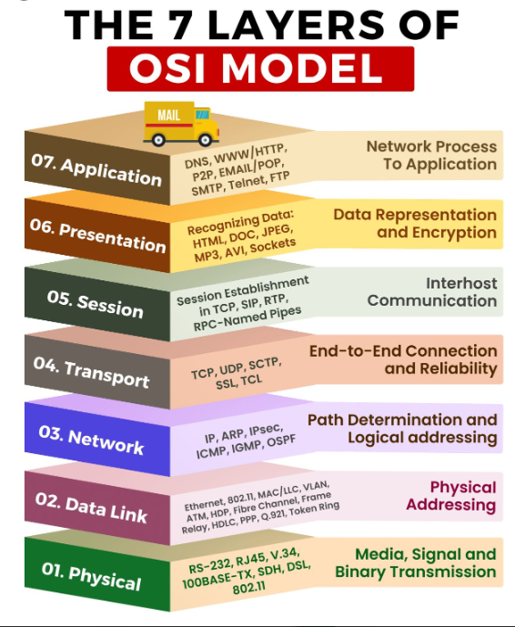
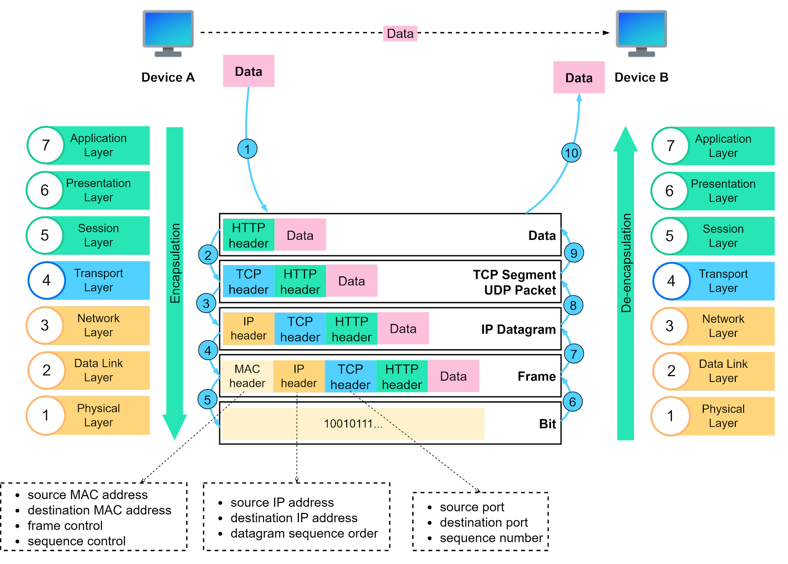
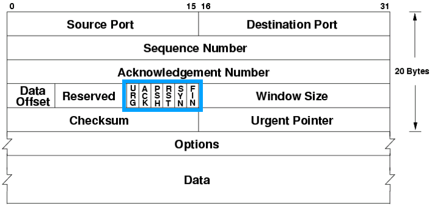
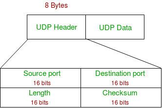
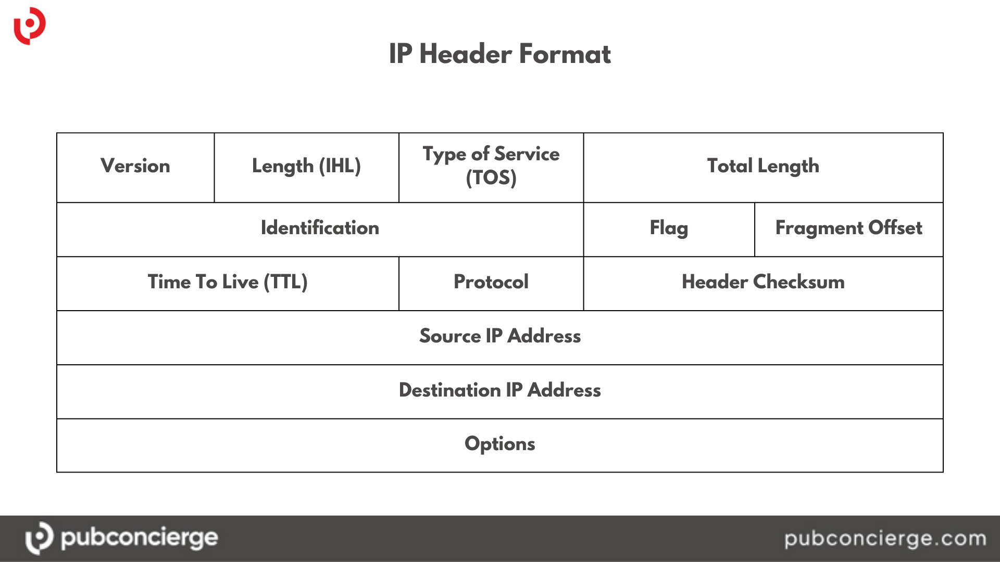
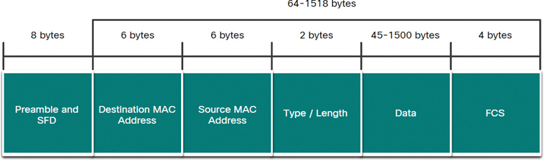

# OSI Model (Open Systems interconnection Reference Model)

The OSI model was developed by the International Organization for Standardization (ISO) as a way to standardize networking protocols and ensure interoperability between different systems and technologies.

The OSI model is more theoretical and comprehensive, whereas the TCP/IP model is practical, focused on real-world implementation, and serves as the basis for the Internet.

However one of the benefits of using this OSI model is that it can be used equivalently across lots of different technologies and devices and manufactures.

`Please Do Not Throw Sausage Pizza Away`

Our networks are designed for the purpose of making data flow across those networks. The name of data actually gets changed through the layers of the OSI model. Layer five, six, and seven are using the term 'data'. However it can be called 'segments' or 'datagrams' in the fourth layer. In the layer three or network layer, I can call it a 'packet'. In the layer 2 or data link layer, it can be called 'frames'. And finally, I can convert the data into ones and zeros, so that it can be referred to 'bits' at the physical layer.

`Do Some People Fear Birthdays`

## Layer 1 - Physical

The Physical Layer is responsible for the transmission of raw bit streams over a physical medium. It deals with the physical characteristics of the communication medium, such as voltage levels, timing of voltage changes, and data rates.

Transition Modulation involves converting digital bits (0s and 1s) into specific electrical, optical, or radio waveforms that can be transmitted over a physical medium such as copper wires, fiber optics(light), or air.

Cables are also part of the physical layer. If I am using something like a Cat 5 or a Cat 6 cable, I may have a certain connector on the end. The way that connector is wired is based on a certain standard. There are two type of standards.

- TIA/EIA-568A

- TIA/EIA-568B

Layer 1 devices view networks from a physical topology perspective.

Layer 1 is synchronizing our communication. It should be ensured that bits can be either be transmitted asynchronously or synchronously.

In **asynchronous networking**, I should consider something like a **voicemail, email, and messaging**. This communication happens **out of sync or out of time (irregular intervals)**. This asynchronous communication uses **start and stop bits** to indicate when transmissions occur from the sender to the receiver.

In **synchronously networking**, people have to be in **the same place at the same time**. It is something like **phone-calls**. This synchronous networking perspective uses **a reference clock** to coordinate the transmissions by both sender and receiver.

The way to utilize the bandwidth of the cable,

- **Broadband** divides bandwidth into separate channels for asynchronous communication. For example, TV service carries multiple channels having a single cable or Satellite.

- **Baseband** uses all available frequencies on a medium (cable) to transmit data. It uses a reference clock and synchronous communication. For example, a telephone uses baseband communication. And a wired home ethernet network can be also the example of this baseband communication because it uses all of the frequency that is available on the cable.

Multiplexing is a technique used to allow multiple signals or data streams to be transmitted over a single communication channel (wired or wireless). This helps make better use of the available bandwidth and increases efficiency. There are three main types of multiplexing to share bandwidth efficiently.

- Time-Division Multiplexing (TDM) : Uses time slots for each session. Telephone networks often use TDM to allow multiple calls to share the same communication line without interference.

- Statistical Time-Division Multiplexing (StatTDM) : Dynamically allocates the time slots on an as-needed basis. This is useful in network scenarios where not all connections are active at the same time, improving efficiency by reducing wasted bandwidth.

- Frequency-Division Multiplexing (FDM) : Divides channels based on frequencies. Radio broadcasting uses FDM to transmit multiple radio stations over the same frequency spectrum by assigning different frequencies to each station.

Layer 1 devices are essentially repeaters, passing along whatever is received.

For example,

Devices such as **repeaters**, **hubs**, **media converters**, and a **Wireless Access Point (WAP) used for Wi-Fi** and devices utilizing **Bluetooth** operate primarily at the Physical Layer (Layer 1) of the OSI model.

## Layer 2 - Data Link (Defines the format of data on the network)

Data Link Layer packages data into **frames** and transmits those frames on the network while performing some error detection, correction, identifying unique network devices using **MAC addresses**, and providing some flow control. In short, it ensures that data is transmitted accurately and efficiently between devices on the same local network segment with the MAC addresses.

Every manufacturer of a network card assigns a unique 48-bit identifier to every network interface card (NIC) they produced. It can be called MAC address.

`D2:51:F1:3A:34:29`

`D2:51:F1` represents the particular vendor or manufacture of the NIC (OUI - Organizationally Unique Identifier)
`3A:34:29` represents the exact machine it belongs to

Logical Link Control (LLC) sublayer of the Data Link Layer provides connection services and allows acknowledgement of receipt of message. LLC is the most basic form of flow control by limiting the data that a sender can send at once and allowing the receiver to keep from being overwhelmed.

Additionally, the LLC sublayer offers basic error control functions through mechanisms like checksums. For example, a checksum can be used to verify the integrity of the received data by comparing the calculated checksum of the received data against the transmitted checksum. If there is a mismatch, it indicates an error in transmission.

Communication across the Layer 2 can be synchronized according to three different schemes. It refers to how data transmission is managed and synchronized between devices on a network at the Data Link Layer. The choice of scheme depends on the specific requirements of the application, such as the need for timing precision, the nature of the data being transmitted, and the flexibility required for communication.

1. **Isochronous Communication** means that all network devices use a common reference clock source to synchronize their operations. This clock ensures that data is transmitted at precise intervals.

2. **Synchronous Communication** means that network devices agree on a timing method or clocking scheme to understand when data begins and ends.

3. **Asynchronous Communication** means that each network device operates based on its internal clock and uses special bits to signal the start and end of data frames.

Layer 2 devices are like

Switches, Bridges, Network Interface Card (NIC)

## Layer 3 - Network (Decides which physical path the data will take)

Layer 3 is responsible for determining the best path for data packets to travel across networks. And it handles logical addressing (e.g., IP addresses) to identify devices on the network.

**Logical address**

IPv4 and IPv6 are the primary protocols used at Layer 3.

Example of an IPv4 address: `172.16.254.1`. This address is represented in dotted decimal notation, where the address is divided into four octets (each ranging from 0 to 255).

There are three main methods for forwarding or routing data :

- **Packet switching** : Data is divided into packets and then forwarded.

- Circuit switching : Dedicated communication link is established between two devices. And constant communication path is maintained for the duration of a conversation.

- Message switching : Data is divided into messages which may be stored and then forwarded.

Most networks use packet switching

**Route discovery and selection**

This involves determining the best path for data to travel across a network. Routing protocols assist in this process by enabling routers to exchange information about the network.

- Static route : routes are manually configured by a network administrator and do not change unless manually updated.

- Dynamically assigned route : all of these routers continually talk to each other all the time. And they tell each other which way they know how to get to other routers and which one is the best and fastest route.

**Connection Services**

Layer 3 also provides connection services that enhance the reliability of data transmission. These services build upon the connection services provided at Layer 2.

Flow Control : Ensures that the sender does not transmit data faster than the receiver can process it, preventing data loss.

Packet Reordering : Sometimes packets may arrive at their destination out of order. Packet reordering is a process that ensures the data is correctly reassembled in the original order.

Error Messaging : The Internet Control Message Protocol (ICMP) is used to send error messages and operational information, such as with tools like `ping` and `traceroute`.

For example,

Routers (Multi layer switches)

## Layer 4 - Transport (Transmits data using transmission protocol including TCP and UDP)

Transport layer is the dividing line between the upper layers and the lower layers of the OSI model.

**TCP** is a transmission control protocol. It is a connection-oriented protocol that is a reliable way to transport segments across the network. If a segment is dropped, the protocol will actually ask for acknowledgement each and every time. If it fails to get the acknowledgement, it will resend that piece of information. TCP protocol can be used in e-commerce, websites, and banking services.

TCP three-way handshake

SYN -> SYC-ACK -> ACK

**UDP**(User Datagram Protocol) is what can be called as a connectionless protocol. It does not have to wait for connections. UDP is a unreliable way. If the datagram is dropped, the sender is unaware. So it is good for audio and visual streaming.

TCP is for segments and UDP is for datagram

**TCP** | Reliable | Connection-oriented | Segment retransmission and flow control through windowing | Segment sequencing | Acknowledges segments

**UDP** | Unreliable | Connectionless | No windowing for retransmission | No sequencing | No acknowledgement

There are a couple of extra reliability features.

**Windowing** is a flow control mechanism that allows the sender to adjust the amount of data it transmits before waiting for an acknowledgment from the receiver. If the sender notices that many retransmissions are occurring, it indicates that too much data is being sent at once, overwhelming the network or the receiver. In response, the sender can reduce the "window size," which is the amount of data it sends before requiring an acknowledgment. By doing this, the sender sends smaller segments of data, reducing the likelihood of retransmissions and improving the efficiency and reliability of the transmission. Windowing helps to balance the flow of data, minimizing retransmissions while maximizing throughput by dynamically adjusting to the current network conditions.

**Buffering** occurs when devices allocate memory to store segments if bandwidth is not readily available. Devices such as routers have a special memory in them that will store segments if the bandwidth is not readily available.

Consider a scenario where a router is receiving a large volume of data from multiple sources faster than it can forward that data to the next destination due to limited outbound bandwidth. The router will start storing this data in its buffer. If the incoming data continues to arrive at a rate faster than it can be transmitted, the router’s buffer may fill up completely.

Once the buffer is full, any additional incoming data has nowhere to go, resulting in a **buffer overflow**. The router then has to drop packets, which can lead to network performance issues such as dropped connections, delays, or the need for retransmissions. This is particularly problematic in high-traffic environments where routers are managing large amounts of data simultaneously.

Device examples,

WAN accelerators, Load balancers and Firewalls

Protocol examples,

UDP and TCP

## Layer 5 - Session (Maintains connections)

**Session** is a conversation that has to be kept separate from all of the others to prevent the intermingling of data. So this session layer keeps conversions separate to prevent intermingling of data.

**Set up session**

This is where we are going to check our user credentials and assign numbers to sessions to help identify them.

**Maintain session**

This is where we are going to transfer data back and forth across the network over and over and over again.

If we have a break in the connection, we can reestablish the connections.

If the connection established successfully, I am going to acknowledge the receipt of the data.

**Tear down session**

This is where the session ends after the transfer is done or when the other party disconnects. Tearing down a session can be done mutually or after the communication has finished.

Devices examples,

H.323(for video connections), NetBIOS

**H.323** used to set up, maintain, and tear down voice and video connections. FaceTime or Skype are probably using like H.323. These operate over the real time transport protocol, known as **RTP**.

**NetBIOS** is used by computers to share files over a network. Windows uses this method of its file sharing as well inside. it provides essential session management services that allow applications on different computers to communicate over a network.

## Layer 6 - Presentation (data encryption)

This layer is responsible for formatting the data to be exchanged and secures that data with proper encryption.

**Data formatting**

Data is formatted by the computer to have compatibility between different devices.

**American Standard Code for Information Interchange (ASCII)** is for text-based language to use. It ensures that data is readable by receiving system. It provides proper data structures and negotiates data transfer syntax for the Application Layer (Layer 7).

Other format of data will be GIF, JPG, PNG, SVG, etc.

**Encryption** is used to scramble data as it goes in transit to keep it secure from any prying eyes.

For example, **TLS (Transport Layer Security)** is being used to secure the data between my computer and a website like Facebook or Google.

TLS connections create an encrypted tunnel, so nobody else can see what's inside it, such as username, password, or credit card information.

SSL (Secure Sockets Layer) was the predecessor to TLS and was commonly used for securing data, though it has largely been replaced by the more secure TLS.

SSL -> TLS

**Scripting languages** like HTML, JavaScript, or PHP operate at the Presentation Layer because they are involved in formatting and structuring data for display and interaction on the web.

## Layer 7 - Application (Human-computer interaction)

This layer provides application-level services where users communicate with the computer.

**File transfer**

**Network transfer**

**Application services** are the thing that unites communicating components from more than one network application.

It belongs to the low-level protocol. For example, **POP3**, **IMAP** and **SMTP**

**Service Advertisement**

This is where applications can send out announcements to other devices on the network to state the services they offer.

For example,

Email applications (IMAP, SMTP, or POP3)

Web browsing applications (HTTP, HTTPS)

Domain Name Service (DNS)

File Transfer Protocol (FTP, FTPS, SFTP)

Remote Access (Telnet, SSH and Simple Network Management Protocol)

# The way to send data on the networks

The data is continuously being encapsulated and decapsulated as it moves up or down the layers of the OSI model.

## Encapsulation

Encapsulation refers to wrapping data with additional information (headers and trailers) as it moves down through the OSI model layers.

## Decapsulation

Decapsulation is the reverse process removing the wrappers (headers) as the data moves back up through the OSI layers.

When the data reaches its destination, each layer will remove its specific header, like opening an envelope and taking out the contents. Once the data reaches the Application Layer, it’s in a format that the application can understand and process.

## OSI Reference Model

- Layer 7 (Application): The user sends data (e.g., using HTTP). A Layer 7 header with relevant information (like the type of application) is added to the data.

- Layer 6 (Presentation): Encryption and formatting occur, and a Layer 6 header is added.

- Layer 5 (Session): Information about the session (such as session management) is added as a Layer 5 header.

- Layer 4 (Transport): At this layer, the transport protocol (TCP or UDP) adds a header. If TCP is used, information like source and destination ports, sequence numbers, and flags (like SYN and ACK) are included. If it's UDP, the header is smaller with only basic details like source and destination ports.

  **TCP Headers** (20 byte - 60 bytes in size)

  

  - SYN (Synchronization) is used to synchronize a connection during the three-way handshake.

  - ACK (Acknowledgement) is used during the three-way handshake, but also used to acknowledge the successful receipt of packets.

  - FIN (Finished) is used to tear down the virtual connections created using the three-way handshake and the SYN flag.

  - RST (Reset) is used to immediately terminate the connection if something goes wrong or if a server wants to reject a connection request.

  If the server does not want to accept the connection (e.g., it's overloaded, the service is unavailable, or it doesn't allow that client), it can respond by sending an RST (Reset) packet instead of the usual SYN-ACK response.

  - PSH (Push) is used to ensure data is given **priority** and is processed at the sending or receiving ends. It used by the sender to indicate data with a higher priority level.

  - URG (Urgent) is similar to PSH and identifies incoming data as urgent. It is sent to tell the recipient to process it immediately by ignoring anything else that's in the queue.

  UDP header (only 8 bytes in size)

  

- Layer 3 (Network): The data gets an IP header containing source and destination IP addresses, which helps routers determine where to send the packet.

  IP Header

  

- Layer 2 (Data Link): An Ethernet header with MAC (Media Access Control) addresses is added, helping switches direct the frame to the correct device on the local network.

  Ethernet Header

  

  - EtherType is used to indicate which protocol is encapsulated in the payload of a frame. (IPv4, IPv6)

- Layer 1 (Physical): The data is converted into a series of electrical or optical signals, which is transmitted across the physical medium (e.g., Ethernet cable).

## Wireshark

It is the packet analyzer that can pull apart some network traffic and show different layers of the OSI model.
