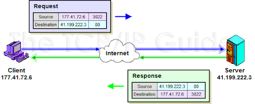

# Ports and Protocols

## Network Port Fundamentals

**Port** is a logical opening in a computer that represents a service or application.

Ports range from 0 to 65,535, and are divided into three categories:

- **Well-known ports (0 – 1,023)** – Reserved for well-known services like HTTP (port 80) or HTTPS (port 443).

- **Registered ports (1,024 – 49,151)** – Registered with the Internet Assigned Numbers Authority (IANA) for specific applications.

- **Ephemeral ports (49,152 – 65,535)** – Temporary, randomly assigned for short-lived communication.

When a client connects to a web server, it uses its IP address and an ephemeral port, while the server listens on a well-known port like 80 for HTTP. Data is sent back and forth between the client’s ephemeral port and the server's well-known port until the session ends, at which point the ephemeral port is closed.

## Transmission Control Protocol (TCP)

TCP, which operates at the transport layer of OSI model, is a fundamental protocol within the internet protocol suite that consists of set of rules that govern the exchange of data. And it ensures that all the data packets reach their intended destination in the correct order and without corruption.

- Error checking / Data sequencing

TCP uses sequence number and acknowledgment messages to assure the data is being received correctly and in the proper order.

TCP also employs flow control to prevent the sender from overwhelming the receiver with too much data at once.

This flow control is achieved by Windowing. Windowing occurs by allowing the receiver to specify the amount of data it can handle at a time.

When sending data over the network, the transmission control protocol will use ports as part of its communication process. **TCP uses ports to allow for the logical differentiation of services on a single physical machine**.

- Acknowledgement

TCP ensures reliable transmission of data by breaking down larger messages into smaller packets.

Three way handshake

It is to ensure that both the sender and the receiver are ready for data transmission and that the communication channel is reliable and secure.

`SYN (Synchronize) -> SYN-ACK(Synchronize-Acknowledge) -> ACK (Acknowledge)`

In the SYN process, the client is going to send a SYN packet to the server to initiate a communication session.

Then, the server will respond back with a SYN-ACK packet to acknowledge receipt of the SYN packet and to inform the client that the server is willing and able to establish a session.

Finally, the client will send an ACK packet back to the server to confirm the establishment of that connection.

## User Diagram Protocol (UDP)

UDP is a communication protocol used across the internet for especially time-sensitive transmissions such as video playback or DNS lookups.

- Low Latency

UDP does not need acknowledgement from the receiver, leading to faster data transfer rates, but less reliable. So UDP is used in situations where the speed of the transmission is much more important than the precision of the data.

For example,

Live broadcast, Online gaming, Voiceover IP calling, Streaming video, DNS lookup,

- Stateless

UDP does not maintain the state of the connection or keep track of the packets like HTTP/HTTPS protocol.

- Reduced processing overhead

UDP packets are much simpler and smaller than TCP packets because each UDP header diagram only consists of source and destination port numbers, length field, and checksum.

UDP relies on ports to help differentiate between multiple services or applications they are running on the same physical client or server. And it uses ports to direct data to the correct application.

Each datagram does contain the source and destination ports inside of its header and this helps direct the datagram to the correct application process on the receiving end.

## Internet Control Message Protocol (ICMP)

ICMP, which operate at the network layer of the OSI model, is a integral part of the internet Protocol Suit which is a set of networking protocols used on the internet. It is not used for sending data between two different systems. It is for **diagnosing network communication issues and providing hosts with information about network problems(error reporting and testing)**.

ICMP messages are quite useful when a service or host is un reachable, when a packet's time to live has expired, or when a router cannot forward packets due to its duffer being filled up.

`PING` uses ICMP to send an ICMP Echo Request message to test the reachability of a host on a given IP network. ICMP protocol is encapsulated within the IP packets. It operates at the Network Layer (Layer 3) of the OSI model.

ICMP messages have a simple structure and each message starts with a header consisting of three different things.

- **Type** indicates the type of ICMP message being transmitted.

- **Code** provides additional context about the message type.

- **Checksum** is used for error checking the message header and data.

ICMP lacks the reliability mechanisms of TCP. Instead ICMP prioritizes speed and simplicity over data integrity and security.

So ICMP is useful for error handling and diagnostics.

Attack type exploiting ICMP,

- ICMP Flood Attack is a type of attack that involves overwhelming a target machine with a large number of ICMP Echo Request packets. It is also know as Ping Flood Attack.

- Distributed Denial of Service (DDoS) attack is where the attacker usually uses a network of compromised computers to generate a significant amount of traffic.

- Ping of Death is a type of attack that exploits a vulnerability that existed in older, unpatched systems where the attacker sends malformed or oversized packets using the ICMP protocol.

window : `ping <ip address> -1 65500 -w 1 -n 1`
linux : `ping <ip address> -s 65500 -t 1 -n 1`

Modern networking system and operating systems are no longer vulnerable to these attacks.

If ICMP is blocked, it does make troubleshooting the network connectivity issues a little bit harder because the administrator is unable to use tools like ping and traceroute to determine if the network connectivity is working properly and firewalls will drop the ICMP packets or return a host unreachable error.

## LLDP (Link Layer Discovery Protocol)

LLDP is a Layer 2 (data link layer) protocol used by network devices to advertise their identity, capabilities, and neighbors on a local area network (LAN). By using LLDP, the technician can identify the specific switch and port to which the VoIP handset is connected. The device can query the switch for LLDP information and obtain details about the connected device, including the port number.

## Web Ports and Protocols

Port 80 for HTTP protocol

Hypertext Transfer Protocol (HTTP) is an application layer protocol that enables plain text communication between clients and servers.

Data sent through HTTP is not encrypted and secured. So data that is being sent over port 80 using HTTP is vulnerable to **eavesdropping** and **on-path attack** because that data could be read or modified by an attacker as it is transmitted over the local or wide area network.

Port 443 for HTTPS protocol

Hypertext Transfer Protocol Secure (HTTPS) is essentially the exact same protocol as HTTP, but it adds a layer of encryption by sending the data through a Secure Socket Layer (SSL) tunnel, or the newer and more modern variant, which is called the Transport Layer Security (TLS) protocol.

SSL and TLS will encrypt the data before it is sent and then it will decrypt the data upon its arrival at the destination.

So HTTPS is good to be handling sensitive data, for example online banking, e-commerce websites, and any website with a login page.

Main differences between HTTP and HTTPS

1. Security and encryption

   Any traffic sent over port 80 (HTTP) is going to be unencrypted and sent in plain text using HTTP.

   Any traffic sent over port 443 (HTTPS) is going to be encrypted and sent using HTTPS. Because HTTPS SSL/TLS encryption for HTTPS provides more security than HTTP.

2. Default usage

   Port 80 (HTTP) is traditionally used for unsecure web browsing, and that was the default used by all servers and web browsers since 1991.

   Port 443 (HTTPS) was introduced a few years after, back in 1994, as a method for securing and encrypting web browsing traffic. For now, over 95% of web traffic now uses the secure HTTPS on port 443.

3. Search Engine Optimization (SEO) and trust

   HTTPS builds user trust, leading to more traffic, which signals search engines to rank the website higher. This loop boosts the website’s SEO, contributing to better search rankings.

- Port 80 (HTTP): Plain text, unencrypted.
- Port 443 (HTTPS): Encrypted using SSL/TLS, secure.

## Email Ports and Protocols

These protocols are the backbone of email communication and they ensure that messages are sent, received, and managed efficiently.

- **Simple Mail Transfer Protocol (SMTP)** - **TCP port 25** is the standard protocol used for sending emails. It is only for sending emails, not for receiving them.

- Simple Mail Transfer Protocol Secure (SMTPS) - port 465 or 587 was introduced as a secure variant of SMTP because data under SMTP is sent in the plain text. It is a way to secure the SMTP protocol by transporting it via the secure socket layer or transport layer security protocols. This creates an encrypted tunnel, and then the SMTP protocol can tunnel its data through that encryption tunnel.

- Post Office Protocol version 3 (POP3) - port 110 is used to retrieve emails from a remote server to a local client. This protocol is designed to download messages from the server to the email client and then delete those messages from the email server after they are downloaded. POP limits email access on multiple devices as messages are stored only on the initial device that downloaded the messages. And POP3 has also limitation that read or delete status was not synchronized across devices. Moreover POP3 does transmit the emails in plain text because it is considered to be an insecure protocol.

- Post Office Protocol version 3 Secure (POP3S) - port 995 is to overcome this limitation, POP3S was introduced. It uses an SSL or TLS tunnel to encrypt the POP3 data as it moves between an email server and an email client.

- Internet Message Access Protocol (IMAP) - port 143 is to receive emails. It allows users to manage emails directly on the email server. It offers more flexibility then POP3. This means that people can access and synchronize their messages across multiple devices as long as they have an available internet connection. IMAP initially lacked security, transmitting emails in plaintext between server and client.

- Internet Message Access Protocol Secure (IMAPS) - port 993 transmit data inside of an encrypted SSL or TLS tunnel and then send the data through the encryption tunnel using the standard IMAP protocol.

Port 25 (SMTP): Sending emails (unsecure).
Port 465/587 (SMTPS): Secure email sending (over SSL/TLS).
Port 110 (POP3): Retrieving emails (unsecure).
Port 995 (POP3S): Secure POP3 (SSL/TLS).
Port 143 (IMAP): Email management on the server (unsecure).
Port 993 (IMAPS): Secure IMAP (SSL/TLS).

## File Transfer Ports and Protocols

This is the specialized rules and procedures that are utilized for the transmission of files across networks, operate on the designated ports, and act as doorways for data transfer activities.

- **File Transfer Protocol (FTP)** - **TCP port 20 (actual data transfer)** or **TCP port 21 (sending control command/administer a session)** is one of the oldest protocols that is used for transferring files between a client and a server over a network. Whenever an FTP session is going to be initiated, the client will first use port 21 to communicate with the server, authenticate if necessary and then set up the file transfer. Once those commands are sent then the data transfer takes place over the port 20. Transmissions over FTP are not encrypted and are sent in plaintext.

- **Secure File Transfer Protocol** (SFTP) - **TCP port 22** was created to address the security concerns of FTP. **SFTP creates a "tunnel" through SSH**. SSH encrypts the connection, making it secure and private.

- Trivial File Transfer Protocol (TFTP) - port 69 is the simpler and more basic version of the FTP. TFTP is a very basic form of file sharing protocol and designed for sending files when minimal security is sufficient.

- Server Message Block (SMB) - port 445 allows computer apps to read and write to files and request services from the server programs. SMB is predominantly used for Windows file sharing and it allows Windows computers to communicate with each other and share files over a network. Samba on Linux systems does rely on the SMB protocol. SMB is used inside local area networks (LAN), and it is not a protocol to send data across the Internet.

port 20/21 (FTP): File transfer (unsecure).
Port 22 (SFTP): Secure file transfer (over SSH).
Port 69 (TFTP): Simple, unsecure file transfer.
Port 445 (SMB): Windows file sharing.

## Remote Access Ports and Protocols

These protocols build and manage systems and networks from across the network.

- **Secure Shell (SSH)** - **TCP port 22** is a protocol that's used for secure remote login and other secure network services over an unsecure network. It provides a secure channel over an insecure network in a client server architecture that offers strong authentication and encrypted data communications for anything inside of that SSH tunnel. This secure encrypted tunnel allows people to operate text-based commands from a remote server. It is for secure command line-based management.

- **Telnet** - **TCP port 23** is one of **the earliest remote login protocols**(username & password authentication), allows a user on one computer to login remotely to another computer that is part of the same network and **command execution**. Telnet was designed for local area networks only, although some people have used it over the internet. Telnet actually **transfer its data in plain text**, so it is **not secure protocol**. This is why SSH was developed. I should never use telnet.

- **Remote Desktop Protocol (RDP)** - **TCP port 3389** is the proprietary protocol that was developed by Microsoft to provide users with a graphical user interface to connect to another computer over a network connection. It only allows to issue and receive text-based information. It supports different types of network topologies and multiple LAN protocols. It allows for smart card authentication, data encryption, and bandwidth reduction mechanisms.

Port 22 (SSH): Secure remote login.
Port 23 (Telnet): Remote login (unsecure, plain text).
Port 3389 (RDP): Microsoft remote desktop (secure graphical interface).

## Network Service Ports and Protocols

These are crucial for the smooth functioning of digital communications and network management.

- **Domain Name System (DNS)** - **TCP/UDP port 53** is just like the internet phone book. This system is used to translate human-friendly domain names into an IP address that computers can use to identify each other on a network. It operates on two different transport protocols, both TCP and UDP. It uses UDP for querying and response messages that fit within a single packet. If there is a larger message that needs to be sent, it is going to use TCP for those larger messages.

- **Dynamic Host Configuration Protocol (DHCP)** - **UDP port 67 (server)** and **UDP port 68(client)** is used to automate the assignment of IP addresses, subnet masks, gateways, and other networking parameters (including DNS IPs) to a client device. It simplifies of configuring devices on our IP networks.

- **SQL Services** - **TCP port 1433 (Microsoft SQL)** or **TCP port 3306 (MySQL)** refers to the protocols used by database servers to manage queries and control operations from the client applications that are requesting them.

- Simple Network Management Protocol (SNMP) - port 161 and port 162 is used for collecting information from or configuring different network devices like servers, printers, hubs, switches, and routers over an IP network. It uses UDP. Port 161 is used by SNMP managers that are communicating with the SNMP agents on the different devices to conduct polling. Port 162 is used when agents want to send unsolicited trap messages back to the SNMP manager, which essentially is reporting information back to the manager about the client device. SNMP is crucial for network diagnostics and performance monitoring and is something people will use heavily as a network administrator or network technician.

- System Logging (Syslog) - port 514 is a standard for message logging that allows devices to send event messages across IP networks to an event message collector known as a Syslog server. It uses UDP or TCP. If I want to use standard messaging and logging, it will use UDP. However if I have a situation where reliability becomes a concern, I can configure it to use TCP.

Port 53 (DNS): Translates domain names to IP addresses.

## Other Network Service Ports and Protocols

- **Network Time Protocol (NTP)** - **UDP port 123** is used to synchronize the clocks of a computer over a given network. It uses UDP. It enables our networks to maintain accurate time with precision and reliability, which is crucial for transaction logging, security protocols and the coordination of system functions.

- **Session Initiation Protocol (SIP)** - **UDP port 5060** and **TCP/TLS port 5061** is widely used for initiating, maintaining, and terminating real-time sessions that involve voice, video messaging, and other communication services. 

- Lightweight Directory Access Protocol (LDAP) - port 389 is a protocol for accessing and maintaining distributed directory information services over an IP network. It is used to look up information in a directory listing. It uses both TCP and UDP. It transmits all that information in plain text.

- Lightweight Directory Access Protocol over SSL (LDAPS) - port 636 is a version of LDAP that is encrypted with SSL or, in newer versions, TLS for increased security. It uses TCP. This protocol provides secure directory service transactions that protects the sensitive data during the transmission by placing it inside of an encrypted tunnel.

### Key Components of IEEE

1. VLANs (Virtual Local Area Networks) - **IEEE 802.1q**

   - Purpose: This standard defines how to implement VLANs in Ethernet networks by tagging frames with VLAN identifiers. This allows multiple VLANs to coexist on the same physical network.

   - Functionality: It adds a 4-byte tag to Ethernet frames, which contains information about the VLAN to which the frame belongs.

2. Spanning Tree Protocol (STP) - **IEEE 802.1d**

   - Purpose: STP is designed to prevent loops in Ethernet networks, which can cause broadcast storms and network failures.

   - Functionality: It creates a loop-free topology by designating a root bridge and blocking redundant paths in the network.

3. **Link Aggregation Control Protocol** - **802.3ad**

   - Purpose: This standard allows multiple network connections to be combined into a single logical link. By aggregating links, the combined bandwidth of the physical links is available to the network, enhancing performance and fault tolerance.

   - Functionality: It uses Link Aggregation Control Protocol (LACP) to manage the aggregation of links.

4. Network Access Control / RADIUS / TACACS+ - **IEEE 802.1X**

   - Purpose: This standard provides port-based network access control, allowing organizations to authenticate devices before they gain access to the network.

   - Functionality: It works with authentication servers (like RADIUS) to verify user credentials before allowing network access.

5. Quality of Service (QoS) - **IEEE 802.1P**

   - Purpose: This standard provides a mechanism for prioritizing network traffic to ensure that time-sensitive data (like voice and video) is transmitted with higher priority over other types of traffic.

   - Functionality: It adds priority information to Ethernet frames, enabling switches to manage traffic based on priority levels.

6. Power over Ethernet (PoE) - **IEEE 802.3AF**

   - Purpose: This standard allows network cables to **carry electrical power along with data** to power devices such as IP cameras, VoIP phones, and wireless access points. the "AF" stands for "Audio-Video Bridging".

   - Functionality: It specifies the requirements for delivering power over Ethernet cabling, including power classification and power sourcing equipment.

7. Ethernet Physical Layer Standards - **IEEE 802.3**

   - Purpose: Defines various Ethernet standards for wired LAN technologies, including speed, cabling, and signaling.

   - Examples

      - 10Base-T: 10 Mbps over twisted pair.
      - 100Base-TX: 100 Mbps over twisted pair.
      - 1000Base-T: 1 Gbps over twisted pair.
      - 10GBase-SR/LR: 10 Gbps over multimode/single-mode fiber.
