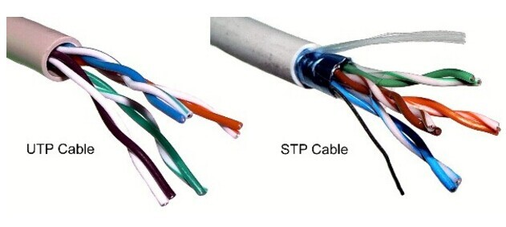
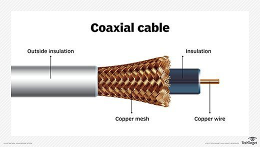
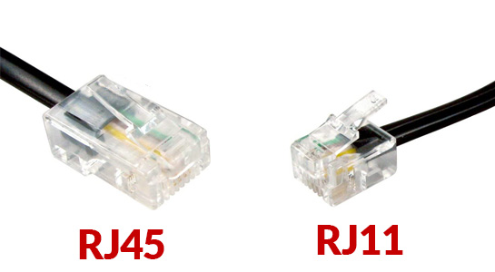
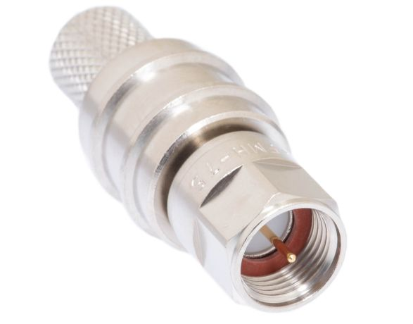
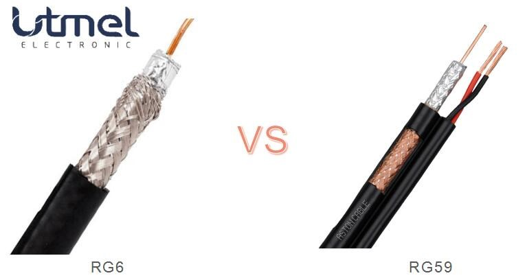
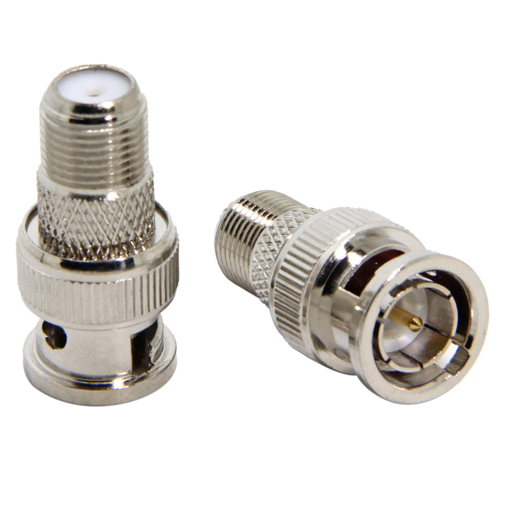
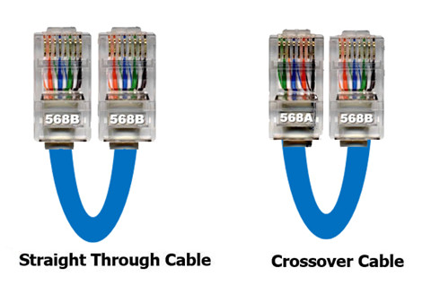
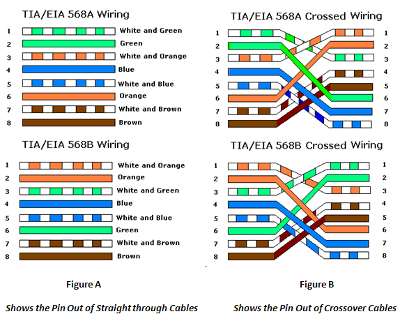
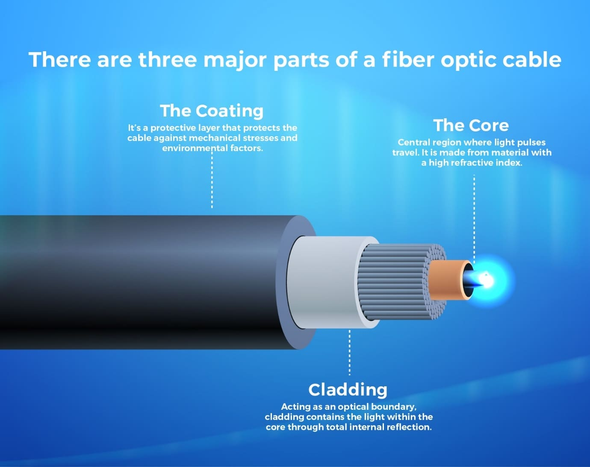

# Media and Connectors

Copper media has been a default cable type in networks for decades and is integral to network infrastructure.

This lesson focuses on the 802.3 Standard, which defines the specifications for Ethernet protocols and wiring, commonly used in local area networks (LANs).

- IEEE 802.3 Standard

The IEEE 802.3 Standard defines the physical and data link layers (specifically Media Access Control or MAC) for wired Ethernet networks.
Includes specifications for various cable types: twisted pair cables, coaxial cables, twin-axial cables, direct attach copper, and fiber optic cables.

## Copper Cables

1.  Twisted Pair Cables : Two conductors twisted together to reduce electromagnetic interference (EMI) and crosstalk. Used in transmitting data and voice signals for networking and telecommunications. Twisting enhances signal consistency and reduces susceptibility to interference.

    - Unshielded Twisted Pair (UTP) : Most common, lightweight, flexible, and cost-effective. No additional shielding, making them smaller and easier to install but more susceptible to EMI(Electromagnetic interference) and noise. Common in Ethernet-based LANs.

    - Shielded Twisted Pair (STP) : Comes with a shielding layer (copper tape, conducting polymer, or braided copper mesh) to block EMI (electromagnetic interference). Used in high-interference environments for better signal quality. More expensive, bulkier and difficult to install compared to UTP but offers better protection and suitable for long distance communication.

    

    Regardless of whether using a shielded or unshielded one, twisted pair cables are categorized (CAT) by speed and distance capabilities:

    CAT 5 | 100 Mbps at 100 meters
    CAT 5e | 1 Gbps (1000 Mbps) at 100 m
    CAT 6 | 1 Gbps at 100 m, 10 Gbps at 55m
    CAT 6a | 10 Gbps at 100 m
    CAT 7 | 10 Gbps at 100 m
    CAT 8 | 10-25 up to 40 Gbps at about 30 meters (Used in data centers)

    All CAT cables are limited to 100 meter length except ofr CAT 6 and CAT 8.

    - Plenum Cables: Designed with fire-resistant jackets for use in air-circulating areas (e.g., HVAC systems). Because Plenum-rated cables meet the stringent requirements of the National Electric Code and National Fire Protection Association.

    - Non-Plenum Cables: Cost-effective but not fire-resistant, used in spaces with low fire risk. It is good to use in home-office networks.

2.  Coaxial Cables : Consist of a single copper conductor, insulating layer, and shield.

    

    - Standard coaxial cables(RG-6, RG-59) are common in broadcasting and broadband systems (e.g., cable TV) because these cables are being used to carry data at **high speeds over longer distances**. RG-6 cables support up to **1 Gbps for 300 meters**. It is used to support faster Internet speeds when using a cable model.

    - Direct Attach Copper (DAC) Cables are the newer form of coaxial cabling and fixed assembly copper cables used to connect network hardware (switches, routers, servers). Cost-effective and consume less power than fiber. **Support up to 100 Gbps for short distances (15 meters for active cables, 7 meters for passive)**. These cables are suitable for interconnect applications between two servers, routers, switches, or other devices.

    - Twin-axial Cables are featured two insulated copper conductors and are optimized for **short-range high-speed signaling**. It supports **10 Gbps or more at 10 meters**. Used in SFP+(small form factor pluggable plus) and QSFP(quad small form factor pluggable) direct attach applications between two routers and switches. It is less vulnerable to EMI.

## Copper Network Connections (physical plugs)

1. RJ-X (RJ-11, RJ-45)

   RJ stands for standardized telecommunication network interface for connecting voice and data equipment to a service provided by a local exchange carrier or long distance carrier. X is just a placeholder for the specific standard number.

   RJ-11 and RJ-45 are going to be used with a **twisted pair of cables for voice and data network**.

   - RJ-11 is the standard connector for telephone wiring. The cable connector can support up to six slots for pins (6P6C), but people typically will use two of these slots for telephone connection. It is not suitable for high-speed data transmission.

   

   - **RJ-45** is the standard connector for data networks that utilize copper cables to **create ethernet network**. This connector has an eight-position and eight-conductor configuration (8P8C). It is going to be widely used in networking to connect computers, switches and routers together inside of a local area network. It can support high-speed data transfer. RJ-45 connectors are used with CAT cables(5e, 6, or higher).

2. RG-X

   RG stands for Radio Guide. That is used with **coaxial cables** for various applications like high-speed Internet connections, television connections, and radio communications.

   RG-6 and RG-59 are used for cable **television connections** and high speed internet service connections respectively.

   - **F-type Connector** is a screw on connector commonly used with both the RG-6 and RG-59 **cable types**. This connector is the standard for cable television and satellite connection and it can be used for cable internet connections too.

   

   - RG-6 is a standard for coaxial cables, and predominantly used in residential and commercial settings. It allows for hight bandwidth and higher frequency applications. And it makes well suited for digital television transmission and high-speed Internet services.

   

   - RG-59 is an older specification for coaxial cables that used to be very common for television and radio signal transmission. It only supports lower bandwidth over shorter distances.

   - Bayonet Neill-Concelman (BNC) Connector is another type of **coaxial connector** that is characterized by its secure bayonet locking mechanism. It provides "push and twist" style connector. This BNC connector can be found in professional video connections, such as studios or video surveillance systems as well as in some radio frequency applications too. This cable is quick, secure, reliable, and stable.

   

## Copper Cable Pinouts (specific internal arrangement of wires)

- Straight-through cable (Patch cable) : Contains **the exact same pinout configuration** (e.g., 568B on both ends) where pin 1 on one side matches pin 1 on the other. Typically used to connect a DTE (Data Terminal Equipment) like computers or routers to a DCE (Data Communications Equipment) like switches or modems. **Used to connect different types of devices**.

These define how the individual wires are arranged in an RJ-45 connector for Ethernet cabling.

- 568A : Green/White, Green, Orange/White, Blue, Blue/White, Orange, Brown/White, Brown.
- 568B : Orange/White, Orange, Green/White, Blue, Blue/White, Green, Brown/White, Brown.

- Crossover cable : Connects **similar devices (e.g., switch to switch, computer to computer)** by swapping the send and receive pins (1, 2, 3, 6) between 568A on one end and 568B on the other. Typically used to connect a DTE to DTE/DCE to DCE. A switch to a switch connection requires a crossover cable. If a switch does not support MDIX (Medium Dependent Interface Crossover - the automated way to simulate a crossover cable even if using a straight-through patch cable), it is required to use a crossover cable to make them communicate.

## Fiber Media

Fiber Optic cables are used to transmit data using light instead of electrical impulse.

Advantages

1. EMI immunity

2. Extended data transmission range

3. Higher data transfer speeds

Drawbacks

1. Expensive

2. Complexity - more challenge to work with than twisted pair of coaxial copper cables because it requires special tools and training to learn how to make fiber cables

Even with these drawbacks of the higher costs and fiber being more difficult to work with though, fiber optic cables have a place in most of our enterprise networks.

- Single-Mode Fiber (SMF) : Designed for long-distance communication and features a small glass core typically around 8.3 to 10 microns in diameter. Yellow sheath

- Multi-Mode Fiber (MMF) : Tailored for shorter distances because it has a larger fiber core size that ranges from 50 to 100 microns. Multi-mode cables with a larger code are cheaper to manufacture. Aqua blue or orange sheath

Network designers often prefer multimode over single mode for its easier handling and cost-effective installation.

Multi-mode fiber is considered ideal for internal network infrastructures such as within an office building or data center, or as a replacement for copper patch cables in a high security environment or any environment that may be subject to higher levels of electromagnetic interference.

## Fiber Network Connections

Fiber Optic Connector will help enable a quicker connection and disconnection from the network.

More fiber optic cables will require two different sets of connectors on that cable. One set will be for the transmission side of the cable. And the other will be for the receive side of that cable.

### Connectors

- Subscriber Connector(SC) : Known for its **square shape and push-pull design** that offers a secure and simple connection mechanism. It is a stick and click connector. The SC connector is durability and ease of use make it a practical choice for various applications.

- Lucent Connector(LC) : Distinguished by a **compact size that utilize a push-pull mechanism** similar to the SC but in a much smaller form factor. In the enterprise **data centers** where space is at a premium and high rates are essential, it is to find the LC connectors are being used there.

- Straight Tip Connector(ST) : Recognizable by its **round shape** and **twist-lock mechanism** that offers a robust and reliable connector type for use in networks. ST connector is commonly used with **multi-mode fiber optic cables** and applications.

- Mechanical Transfer-Registered Jack(MTRJ) : Features a **small**, rectangular design and houses both **the transmit and receive fibers** in a single connector.

- Multi-Fiber Push On(MPO) : Designed to accommodate **multiple fibers in a single connector** to significantly increase the capacity and flexibility of the fiber networks. Inside of a **data center**, MPO connectors are often going to be used for backbone cabling and **high speed interconnections** between the devices.

When it comes to purchasing a cable, I have to consider which type of polish it is going to use.

### Polish

- Physical Contact(PC) : It is going to have a slight curvature in the face of the fiber and a **standard polish**. It provides the **least effective reduction** in back reflection. It only provides slight improvements in back reflection reduction.

- Ultra Physical Contact(UPC) : A **dome shaped** end face for **better core alignment**, and this offers **lower back reflection** than the standard PC style did. UPC is an updated and better version of the older Physical Contact style polish.

- Angled Physical Contact(APC) : Uses an eight degree **angled polish** to greatly reduce the back reflection. APC style has the lowest amount of back reflection which makes them well suited for **hight bandwidth** and **long distance** applications. APC polished connectors are often used in long-haul fiber installations.

### Transceivers

Transceivers are devices that can both transmit and receive data. They convert signals between different formats or protocols, facilitating communication between various network systems.

- Ethernet is used for local, metropolitan, and wide area networks. It defines standards for cabling, connectors, and data transmission.

- Fiber Channel (FC) is a high-speed network protocol used for storage area networks (SANs), known for high throughput, low latency, and supporting both fiber and copper media.

Transceivers act as media converters, changing data between different physical formats (e.g., copper to fiber) while keeping the protocol (Ethernet, Fiber Channel) the same.

Use Cases:

Converting between different media types (e.g., fiber to copper).
Translating between different protocols (e.g., Ethernet to Fiber Channel).
Extending network distance by converting Ethernet to fiber for long-distance connections.

Form Factors of transceivers:

SFP (Small Form-Factor Pluggable): Supports up to 4.25 Gbps. It is associated with a single-channel data link.

SFP+: An upgraded version supporting up to 16 Gbps.

QSFP (Quad Small Form-Factor Pluggable): Supports 40 Gbps, with **faster** variants like QSFP+, QSFP28 (100 Gbps), and QSFP56 (200 Gbps).

QSFP+: Similar to the QSFP. It is slightly faster by reaching speeds of about 41.2 gigabits per second.

Remember that QSFP modules are faster than SFP modules.

All of these are just different types of transceivers that are going to be installed inside of a router, a switch, or other networking device that can convert the light that travels over a fiber optic cable back into an electrical impulse that represents a one or zero that our copper network switches and cables can then understand and utilize.

Also, if I need to convert from one protocol to another, like moving from ethernet to fiber channel or from fiber channel back to ethernet, I can do that too using a transceiver.
